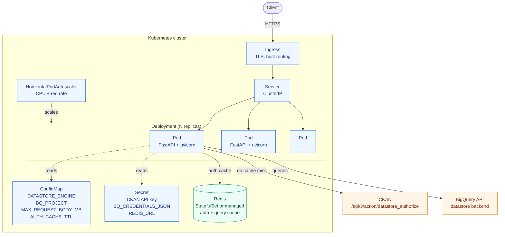
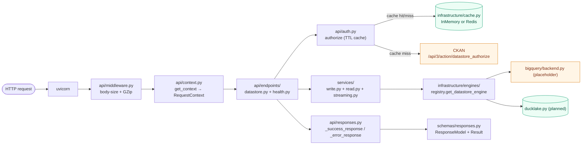

# Datastore API Service
A CKAN-compatible datastore API. Tabular data CRUD + search over a pluggable
storage backend (BigQuery Datastore or Ducklake as future support). 

---

## 1. Goals

- CKAN-compatible request/response shapes for `/api/3/action/datastore_*`.
- Pluggable backend selected by `DATASTORE_ENGINE` env var (`bigquery` or `ducklake`).
- Streaming responses for search (peak memory ≈ 1 row). _Planned, not yet implemented._
- Strict request validation, structured error responses.
- CKAN-based auth gate with TTL-cached decisions (InMemory by default; Redis when `REDIS_URL` is set).


## 2. Technology Stack

| Concern | Choice | Why |
|---|---|---|
| Web framework | **FastAPI** (`fastapi[standard]`) | Async, OpenAPI for free, dependency injection |
| ASGI server | **uvicorn** + `uvloop` + `httptools` | Fast async I/O |
| Validation | **Pydantic v2** (request only) | Strict shape validation, no per-row cost |
| JSON | **orjson** | 5–10× stdlib `json`, returns bytes, datetime-aware |
| Datastore backend | **google-cloud-bigquery** | Managed, cached, scalable |
| HTTP client | **httpx** (`AsyncClient`) | Connection-pooled CKAN auth calls |
| Cache / auth store | **redis** + `hiredis` | TTL cache for auth decisions |
| Schema validation | **frictionless** | Field schema validation on `datastore_create` |


`pyproject.toml` dependencies (target):
```toml
[project]
dependencies = [
    "fastapi[standard]>=0.113,<0.114",
    "pydantic>=2.7,<3",
    "pydantic-settings>=2.3",
    "orjson>=3.10",
    "google-cloud-bigquery>=3.25",
    "redis[hiredis]>=5.0",
    "httpx>=0.27",
    "frictionless>=5.18",
    "uvloop>=0.21",
    "httptools>=0.6",
]

[tool.ruff.lint]
select = ["E", "F", "I"]

[tool.mypy]
strict = true
```

---

## 3. Folder Structure

**Stack split.** Two libraries do most of the heavy lifting and each has one
home in the tree:

- **Starlette** — the web part. Lives in `datastore/api/` and `datastore/main.py`. Everything that
  touches `Request`, `Response`, `StreamingResponse`, middleware, status codes,
  routing, or `Depends` lives here. Nothing else imports from `fastapi` or
  `starlette`.
- **Pydantic** — the data part. Lives in `datastore/schemas/` (request/response
  models) and `datastore/core/config.py` (`BaseSettings`). Used for **boundary
  validation only** — never as the internal data type passed between services
  or returned from engines (those use plain dicts, dataclasses, and tuples to
  keep per-row cost at zero).

### Layer rule

```
api  ──▶  services  ──▶  infrastructure
 ▲           │                 │
 │           └──▶ schemas ◀────┘     (schemas = Pydantic models, plain data)
 │                ▲
 └─ uses schemas for request/response shapes only
```

One-way dependency arrow. `infrastructure/` never imports from `api/` or
`services/`. `services/` never imports from `api/`. `api/` is the only layer
that knows about FastAPI/Starlette.

### Tree

```
datastore-api/
│
├── pyproject.toml                    # Project metadata + deps + tool config
├── README.md
├── CLAUDE.md                         # This document — design + execution plan
├── .env.example                      # Template for env vars (every Config field)
├── .gitignore
├── Makefile                          # run, test, lint, format
├── docker-compose.yml                # local: app + redis + ckan
├── Dockerfile
│
├── datastore/
│   ├── __init__.py
│   ├── main.py                       # FastAPI app factory: create_app() +
│   │                                 # lifespan (httpx client, cache, ckan client);
│   │                                 # registers middleware + exception handlers;
│   │                                 # module-level `app = create_app()` for uvicorn.
│   │
│   │ ── 1. API LAYER ─────────────────────────  (FastAPI + Starlette live here)
│   ├── api/
│   │   ├── __init__.py
│   │   ├── routes.py                 # Top-level APIRouter; mounts endpoints/
│   │   ├── context.py                # RequestContext + AuthContext + ContextDep
│   │   │                             # (per-request handles: config, auth, ckan)
│   │   ├── auth.py                   # CKAN `datastore_authorize` with TTL cache —
│   │   │                             # pure async functions; `AuthContext` wraps state
│   │   ├── responses.py              # CKAN envelope helpers (_success_response / _error_response)
│   │   │                             # + orjson-backed ORJSONResponse
│   │   ├── error_handlers.py         # APIError / HTTPException / RequestValidationError
│   │   │                             # → CKAN error envelope mapping
│   │   ├── middleware.py             # ASGI middleware (BodySizeLimitMiddleware today)
│   │   └── endpoints/                # One module per resource group
│   │       ├── __init__.py
│   │       ├── health.py             # /, /health, /ready (CKAN-shaped envelopes)
│   │       └── datastore.py          # /api/3/action/datastore_*
│   │
│   │ ── 2. CORE (cross-cutting, framework-agnostic) ──────
│   ├── core/
│   │   ├── __init__.py
│   │   ├── config.py                 # Pydantic-Settings `Config` (env-driven) +
│   │   │                             # `get_config()` lru-cached factory
│   │   ├── constants.py              # Shared constants (POSTGRES_TYPES map)
│   │   ├── exceptions.py             # APIError taxonomy: ValidationError,
│   │   │                             # AuthorizationError, NotFoundError,
│   │   │                             # ConflictError, ServerError +
│   │   │                             # HTTP_STATUS_TO_TYPE_LABEL map
│   │   └── helper.py                 # Pure helpers (parse_authorization_header, …)
│   │
│   │ ── 3. SCHEMAS (Pydantic — boundary validation only) ──
│   ├── schemas/                      # Inbound request bodies + outbound response
│   │   ├── __init__.py               # types. Never passed between services or
│   │   ├── request.py                # returned from engines.
│   │   │                             #   request.py    – DatastoreCreateRequest,
│   │   │                             #                   DatastoreUpsertRequest,
│   │   │                             #                   DatastoreSearchRequest
│   │   ├── responses.py              #   responses.py  – ResponseModel base +
│   │   │                             #                   per-endpoint envelopes
│   │   │                             #                   (WelcomeResponse,
│   │   │                             #                   StatusResponse,
│   │   │                             #                   DatastoreCreateResponse)
│   │   └── validators.py             #   validators.py – FieldSpec, StringOrList,
│   │                                 #                   PostgresType, helper fns
│   │
│   │ ── 4. SERVICES (business logic, plain Python) ──────
│   ├── services/                     # Orchestration: validate → call engine →
│   │   ├── __init__.py               # shape result. Inputs: plain types or
│   │   ├── write.py                  # validated schemas. Outputs: typed response
│   │   │                             # models. No FastAPI, no raw SQL.
│   │   │                             #   write.py     – create / upsert / delete
│   │   ├── read.py                   #   read.py      – search / search_sql / info
│   │   │                             #                  (engine call, format
│   │   │                             #                  dispatch, pagination links,
│   │   │                             #                  function allow-list)
│   │   └── streaming.py              #   streaming.py – byte-yielding writers
│   │                                 #                  (objects/lists/csv/tsv)
│   │
│   │ ── 5. INFRASTRUCTURE (adapters to the outside world) ─
│   └── infrastructure/
│       ├── __init__.py
│       ├── cache.py                  # CachePort (Protocol) + InMemoryCache +
│       │                             # RedisCache (TTL-based)
│       ├── ckan_client.py            # CKANClient — httpx async wrapper around
│       │                             # CKAN /api/3/action; bind(api_key) per request
│       └── engines/                  # One subpackage per backend.
│           ├── __init__.py           # Re-exports get_datastore_engine, Mode
│           ├── base.py               # DatastoreBackend ABC +
│           │                         # SearchResult / WriteResult dataclasses
│           ├── registry.py           # get_datastore_engine + get_allowed_sql_functions;
│           │                         # dynamic `importlib` dispatch keyed on
│           │                         # context.config.DATASTORE_ENGINE
│           ├──bigquery/             # Engine package (one folder per backend).
│           |    ├── __init__.py       # Re-exports `BigQueryBackend`
│           |    ├── backend.py        # google-cloud-bigquery adapter (placeholder)
│           |    ├── lib.py            # Backend-specific helpers (optional)
│           |    └── allowed_functions.txt   # Per-engine datastore_search_sql
│           |                                  # function allow-list — one name per
│           |                                  # line, `#` comments allowed.
│           └── ducklake/             # Future planned engine
└── tests/
    ├── __init__.py
    ├── conftest.py                   # FakeCKAN, InMemoryCache, TestClient fixture;
    │                                 # CKAN pytest plugin disabled via pyproject
    ├── test_datastore_create.py      # End-to-end HTTP suite (TestClient)
    └── test_write_service.py         # Service-level units with a fake context
```

**Adding a new engine** — drop a sibling folder with the same four files
(`__init__.py` re-exports `BigQueryBackend`; `backend.py` is the
`DatastoreBackend` subclass; `lib.py` is optional helpers;
`allowed_functions.txt` lists allowed SQL functions). No edit to
`registry.py` or `config.py` is required — `DATASTORE_ENGINE` validates
against the set of engine subdirectories that exist at startup, and the
factory dispatches via `importlib.import_module`. The `ducklake.py`
adapter from the original plan will live at
`infrastructure/engines/ducklake/` when it lands.

`scripts/` and `docs/` are intentionally absent today. Add them when there's a concrete need
(seed scripts, operational runbooks). Until then the README + this file are the docs.

### What goes where — rules of thumb

| Folder | Put here | Do NOT put here |
|---|---|---|
| `datastore/main.py` | App factory, lifespan, middleware order, handler registration | Routes, business logic |
| `datastore/api/endpoints/` | Route declarations, request parsing, response building | SQL, engine calls, validation rules — delegate to services |
| `datastore/api/context.py` | `RequestContext`, `AuthContext`, `ContextDep`, `get_context` (per-request DI bundle) | The logic those handles invoke — that lives in `services/` / `infrastructure/` |
| `datastore/api/auth.py` | CKAN `datastore_authorize` orchestration with TTL cache (pure async functions) | Raw CKAN HTTP plumbing — call `CKANClient` |
| `datastore/api/responses.py` | CKAN envelope helpers, `ORJSONResponse` | Anything that needs DB access |
| `datastore/api/error_handlers.py` | Exception → CKAN error envelope mapping | Business rules — raise `APIError` from wherever the rule lives |
| `datastore/core/` | Config (`Config`), exceptions, constants, pure helpers | I/O, FastAPI imports, business orchestration |
| `datastore/schemas/` | Pydantic `BaseModel` request / response / validator types | Methods that do work — schemas are data shapes only |
| `datastore/services/` | Validation that needs cross-input context, calls to engines/cache/CKAN, result shaping | `fastapi`/`starlette` imports, raw SQL strings, HTTP clients (call adapters) |
| `datastore/infrastructure/` | Adapters: cache (Redis / in-memory), CKAN HTTP client, storage engines (BigQuery / DuckLake) | Business rules, FastAPI types, orchestration |
| `tests/` | Test code only | Fixtures that reach into production internals through back doors — go through the public API |

### Hard rules

1. **Only `datastore/api/` and `datastore/main.py` may import from `fastapi` or `starlette`.**
   Greppable invariant: `rg "from (fastapi|starlette)" datastore/services datastore/infrastructure datastore/core` must return nothing.
2. **Only `datastore/schemas/` and `datastore/core/config.py` may import from `pydantic` / `pydantic_settings`.**
   Engines and services pass plain dicts, tuples, and dataclasses.
3. **Engines return a lazy row iterator of tuples, never `list[dict]`.** Streaming
   peak memory ≈ 1 row regardless of result size.
4. **Pydantic validates at the boundary; orjson serialises out.** Don't use
   `model.model_dump()` on hot paths — build dicts inline and `orjson.dumps()`.
5. **No `container.py` / DI framework.** FastAPI's `Depends` plus the engine
   `registry.py` factory are the only wiring mechanisms.

---

## 4. Architecture



Inside each pod:



**Layer responsibilities**

| Layer | Lives in | Knows about |
|---|---|---|
| HTTP | `api/endpoints/`, `api/routes.py`, `api/middleware.py` | Request parsing, status codes, FastAPI |
| Request bundle | `api/context.py` (+ `api/auth.py` for the auth method) | Per-request handles: config, ckan client (bound), auth-with-cache |
| Response | `api/responses.py`, `schemas/responses.py` | CKAN envelope shape, orjson, typed result models |
| Errors | `api/error_handlers.py`, `core/exceptions.py` | APIError taxonomy → status code + `__type` label |
| Business logic | `services/` | Orchestration — no FastAPI, no raw SQL, no HTTP plumbing |
| Storage | `infrastructure/engines/` | Backend ABC + concrete adapters; SQL dialect, connection management, row iterators (when implemented) |
| External adapters | `infrastructure/cache.py`, `infrastructure/ckan_client.py` | TTL cache (InMemory / Redis), httpx-based CKAN client |
| Cross-cutting | `core/` | Config, constants, exceptions, pure helpers |

**Key design rules**
- Endpoints call services; services call engines / CKAN client via `context.ckan`. Endpoints never touch SQL.
- `services/write.py` owns cross-cutting validation that requires context from multiple inputs (e.g., resolving `primary_key` against declared fields once that lands).
- Engines (when implemented) return `SearchResult` with a **lazy row iterator of tuples** — never `list[dict]`. Peak memory ≈ 1 row regardless of result size.
- Pydantic validates inbound (`schemas/request.py`) and documents outbound (`schemas/responses.py`). Outbound serialisation goes through `_success_response` → `ORJSONResponse` → orjson.
- Per-request CKAN client binding happens once in `get_context` (`api/context.py`): the long-lived `httpx.AsyncClient` is owned by the lifespan; each request gets a shallow copy with `api_key` bound.
- No DI container. FastAPI's `Depends` + the engine `registry.py` factory are the only wiring mechanisms.

**Pod-level shape**
- One container per pod: the FastAPI app. Sidecars only for observability (e.g., OpenTelemetry collector).
- `livenessProbe` → `GET /health` (always 200 while the process is up).
- `readinessProbe` → `GET /ready` (200 only when both backends pass `healthcheck()`; pod pulled from Service when 503).
- `terminationGracePeriodSeconds: 30` so in-flight streaming responses drain before SIGKILL.
- Memory bounded by `MAX_REQUEST_BODY_MB` × concurrency for writes; search responses are O(1) peak memory.

**Cluster-level shape**
- `Deployment` with N replicas, fronted by a `ClusterIP` `Service`.
- `Ingress` (NGINX, Traefik, etc.) terminates TLS and routes by host/path.
- `HorizontalPodAutoscaler` on CPU + custom metric (request rate).
- Config: non-secret env vars in `ConfigMap` (`DATASTORE_ENGINE`, `MAX_REQUEST_BODY_MB`, `BQ_PROJECT`, `AUTH_CACHE_TTL`, `HTTP_TIMEOUT_SECONDS`); secrets in `Secret` (CKAN API key, `BQ_CREDENTIALS_JSON`, `REDIS_URL`).
- Redis as in-cluster `StatefulSet` or external managed instance — connection string from Secret. Empty `REDIS_URL` falls back to the in-process `InMemoryCache` (single-pod only).
- DuckLake backend will require single-replica `StatefulSet` + `PersistentVolumeClaim` (when implemented); BigQuery backend supports horizontal `Deployment`.

---

## 5. API Surface

All datastore endpoints sit under `/api/3/action/` to match the CKAN action API.
Health endpoints at the root.

### 5.1 Health

All three return the CKAN envelope shape `{help, success, result: {...}}`.

| Method | Path | Status | Result |
|---|---|---|---|
| GET | `/` | implemented | `{"message": APP_MESSAGE}` |
| GET | `/health` | implemented | `{"status": "ok"}` — liveness; always 200 if process is up |
| GET | `/ready` | implemented (stub result) | `{"status": "ready"}` — should become 503 when backend `healthcheck()` fails (planned) |

### 5.2 Datastore endpoints

Each endpoint takes a single `ContextDep`. The handler calls `context.auth.authorize(...)` and delegates to a service in `services/`.

| Method | Path | Status | Body / Params | Response model |
|---|---|---|---|---|
| POST | `/api/3/action/datastore_create` | **implemented** | `DatastoreCreateRequest` | `DatastoreCreateResponse` |
| POST | `/api/3/action/datastore_upsert` | **implemented** | `DatastoreUpsertRequest` | `DatastoreUpsertResponse` |
| POST | `/api/3/action/datastore_delete` | **implemented** | `DatastoreDeleteRequest` | `DatastoreDeleteResponse` |
| GET  | `/api/3/action/datastore_search` | **implemented** (streaming) | `DatastoreSearchRequest` | `DatastoreSearchResponse` |
| GET  | `/api/3/action/datastore_search_sql` | **implemented** (streaming) | `DatastoreSearchSQLRequest` | `DatastoreSearchResponse` |
| GET  | `/api/3/action/datastore_info` | **implemented** | `DatastoreInfoRequest` | `DatastoreInfoResponse` |

Engine business logic is still placeholder (returns empty results / echoes inputs); the call path, validation, auth, streaming and per-engine `datastore_search_sql` function allow-list are all live. The real BigQuery adapter is the remaining piece — see §7.

---

## 6. Request / Response Contracts

CKAN-style envelope: every response has `help`, `success`, and either `result` or `error`.

### 6.1 `POST /api/3/datastore_create`

Running example: an electricity balancing-market auction-results table. Used
consistently across the rest of §6 so the request → search → info round-trip
is easy to follow.

**Request**
```json
{
  "resource_id": "balancing_auction_results_2025",
  "fields": [
    {
      "id": "auction_id",
      "type": "integer",
      "info": {
        "title": "Auction ID",
        "description": "Unique auction identifier. Stable across all products auctioned in the same market window.",
        "comment": "MANDATORY",
        "example": "144",
        "unit": "N/A"
      }
    },
    {
      "id": "product_code",
      "type": "string",
      "info": {
        "title": "Product Code",
        "description": "Product mnemonic for the balancing service (e.g. DCL, DCH, FFR).",
        "example": "DCL"
      }
    },
    {
      "id": "delivery_start",
      "type": "datetime",
      "info": {
        "title": "Delivery Start (UTC)",
        "description": "First instant of the delivery window. Stored as UTC; clients render local time.",
        "example": "2025-11-04T16:00:00Z"
      }
    },
    {
      "id": "duration_minutes",
      "type": "integer",
      "info": {
        "title": "Delivery Duration",
        "description": "Length of the delivery window.",
        "unit": "minutes",
        "example": "30"
      }
    },
    {
      "id": "clearing_price_gbp_per_mwh",
      "type": "number",
      "info": {
        "title": "Clearing Price",
        "description": "Pay-as-cleared price for the auction. Negative values are possible during oversupply.",
        "unit": "GBP/MWh",
        "example": "47.82"
      }
    },
    {
      "id": "volume_mwh",
      "type": "number",
      "info": {
        "title": "Cleared Volume",
        "description": "Total volume cleared in this auction.",
        "unit": "MWh",
        "example": "120.0"
      }
    },
    {
      "id": "accepted",
      "type": "boolean",
      "info": {
        "title": "Accepted",
        "description": "Whether the bid cleared (true) or was rejected (false)."
      }
    },
    {
      "id": "bidder_metadata",
      "type": "object",
      "info": {
        "title": "Bidder Metadata",
        "description": "Free-form provider-specific metadata captured at submission time.",
        "comment": "Schema not enforced; kept opaque for downstream analytics."
      }
    }
  ],
  "unique_key": ["auction_id", "product_code"],
  "records": [
    {
      "auction_id": 144,
      "product_code": "DCL",
      "delivery_start": "2025-11-04T16:00:00Z",
      "duration_minutes": 30,
      "clearing_price_gbp_per_mwh": 47.82,
      "volume_mwh": 120.0,
      "accepted": true,
      "bidder_metadata": {"unit_id": "DRAX-1", "submission_lag_ms": 412}
    },
    {
      "auction_id": 144,
      "product_code": "DCH",
      "delivery_start": "2025-11-04T16:00:00Z",
      "duration_minutes": 30,
      "clearing_price_gbp_per_mwh": 51.10,
      "volume_mwh": 75.5,
      "accepted": true,
      "bidder_metadata": {"unit_id": "EDF-COTT-2", "submission_lag_ms": 280}
    }
  ]
}
```

- `resource_id` — SQL identifier, required.
- `fields` — non-empty; each entry contains:
  - `id` (or alias `name`) — column identifier; SQL-safe.
  - `type` — column type. Accepts Frictionless canonical (`integer`, `number`, `string`, `boolean`, `date`, `datetime`, `time`, `object`, `array`, `geopoint`, `geojson`, `any`) or SQL aliases (`int4`, `int8`, `bigint`, `varchar`, `text`, `float`, `double`, `numeric`, `bool`, `timestamp`, `json`, …) which are normalised to canonical on storage.
  - `info` — optional **data dictionary** for documentation. Free-form object; recognised keys: `title`, `description`, `comment`, `example`, `unit`, plus any custom metadata. Stored verbatim and round-tripped on `datastore_info`. The outer `type` is canonical; any `info.type` is treated as a hint and ignored. Whitespace in string values is trimmed.
- `unique_key` — string or list of strings; all entries must reference declared field ids. The example uses a composite key (`auction_id` + `product_code`) since one auction clears multiple products.
- `records` — optional; each record's keys must be a subset of declared field ids.
- `primary_key` — accepted for back-compat; emits deprecation warning.

**Response — 200**
```json
{
  "help": "<request URL>",
  "success": true,
  "result": {
    "resource_id": "balancing_auction_results_2025",
    "fields": [
      {"id": "auction_id",                 "type": "integer",  "info": {"title": "Auction ID", "...": "..."}},
      {"id": "product_code",               "type": "string",   "info": {"...": "..."}},
      {"id": "delivery_start",             "type": "datetime", "info": {"...": "..."}},
      {"id": "duration_minutes",           "type": "integer",  "info": {"...": "..."}},
      {"id": "clearing_price_gbp_per_mwh", "type": "number",   "info": {"...": "..."}},
      {"id": "volume_mwh",                 "type": "number",   "info": {"...": "..."}},
      {"id": "accepted",                   "type": "boolean",  "info": {"...": "..."}},
      {"id": "bidder_metadata",            "type": "object",   "info": {"...": "..."}}
    ],
    "primary_key": ["auction_id", "product_code"],
    "unique_key": ["auction_id", "product_code"]
  }
}
```

Optional response fields (omitted from the body when not requested):
- `records` — echoes the input rows back when the request sets `include_records: true`.
- `total` — total row count after the write, populated when `include_total: true`.

### 6.2 `GET /api/3/datastore_search`

**Query params**
| Name | Type | Default | Notes |
|---|---|---|---|
| `resource_id` | str | — | required unless `q` supplied |
| `filters` | JSON-encoded object | `null` | `{"col": value}` or `{"col": [v1, v2]}` |
| `q` | str / JSON | `null` | full-text or per-column |
| `distinct` | bool | `false` | |
| `plain` | bool | `true` | |
| `language` | str | `"english"` | reserved |
| `limit` | int | `1000` | clamped to `[0, 10000]` |
| `offset` | int | `0` | |
| `fields` | comma-separated list | all | |
| `sort` | str | `null` | `"col asc, col2 desc"` |
| `include_total` | bool | `true` | runs `COUNT(*)` if true |
| `records_format` | str | `"objects"` | `objects` / `lists` / `csv` / `tsv` |

**Example request**

```
GET /api/3/datastore_search
    ?resource_id=balancing_auction_results_2025
    &filters={"product_code": "DCL", "accepted": true}
    &sort=delivery_start desc, clearing_price_gbp_per_mwh asc
    &fields=auction_id,product_code,delivery_start,clearing_price_gbp_per_mwh,volume_mwh
    &limit=100
    &offset=0
```

**Response (records_format=objects) — streamed**
```json
{
  "help": "...",
  "success": true,
  "result": {
    "fields": [
      {"id": "auction_id",                 "type": "integer"},
      {"id": "product_code",               "type": "string"},
      {"id": "delivery_start",             "type": "datetime"},
      {"id": "clearing_price_gbp_per_mwh", "type": "number"},
      {"id": "volume_mwh",                 "type": "number"}
    ],
    "records": [
      {"auction_id": 152, "product_code": "DCL", "delivery_start": "2025-11-05T18:30:00Z", "clearing_price_gbp_per_mwh": 39.40, "volume_mwh": 95.0},
      {"auction_id": 144, "product_code": "DCL", "delivery_start": "2025-11-04T16:00:00Z", "clearing_price_gbp_per_mwh": 47.82, "volume_mwh": 120.0}
    ],
    "total": 2,
    "_links": {
      "start": "https://example.com/api/3/action/datastore_search?resource_id=balancing_auction_results_2025&limit=100",
      "next":  "https://example.com/api/3/action/datastore_search?resource_id=balancing_auction_results_2025&limit=100&offset=100"
    }
  }
}
```

`_links` carries the same scheme + host as the request URL, with all
non-`offset` params preserved. `start` omits `offset` (it defaults to 0);
`next` advances `offset` by `limit`. Clients detect end-of-data by an
empty `records` array on the next page — there's no `prev` field today.

`records_format=lists` returns each record as a positional array (column order matches `fields`).
`records_format=csv` / `tsv` return a streaming text body with the header row first.

### 6.3 `POST /api/3/datastore_upsert`

**Request — late-arriving correction to an auction result**
```json
{
  "resource_id": "balancing_auction_results_2025",
  "method": "upsert",
  "unique_key": ["auction_id", "product_code"],
  "records": [
    {
      "auction_id": 144,
      "product_code": "DCL",
      "delivery_start": "2025-11-04T16:00:00Z",
      "duration_minutes": 30,
      "clearing_price_gbp_per_mwh": 48.05,
      "volume_mwh": 120.0,
      "accepted": true,
      "bidder_metadata": {"unit_id": "DRAX-1", "submission_lag_ms": 412, "revision": 2}
    },
    {
      "auction_id": 153,
      "product_code": "FFR",
      "delivery_start": "2025-11-05T19:00:00Z",
      "duration_minutes": 60,
      "clearing_price_gbp_per_mwh": 32.40,
      "volume_mwh": 200.0,
      "accepted": false,
      "bidder_metadata": {"unit_id": "SSE-PEH-3", "rejection_reason": "above_cap"}
    }
  ],
  "include_records": false,
  "include_total": false,
  "force": false
}
```

- `method`: `upsert` | `insert` | `update`. The table's stored `unique_key` (set at `datastore_create`) decides which rows match — the request body itself never carries it.
- `include_records`: if `true`, echoes the written rows back in the response.
- `include_total`: if `true`, the engine runs a `COUNT(*)` after the write and populates `result.total`. Off by default.
- `force`: bypasses optional client-side guards (reserved; backend-specific).

**Response**
```json
{
  "help": "...",
  "success": true,
  "result": {
    "resource_id": "balancing_auction_results_2025",
    "method": "upsert"
  }
}
```

Optional fields appear in `result` only when requested:

- `records` — echoes input rows when `include_records: true`.
- `total` — total row count after the write when `include_total: true`.

`null` is never serialised — fields that aren't populated are simply omitted (see `_orjson_default` in `api/responses.py`).

### 6.4 `GET /api/3/datastore_search_sql`

**Query params**: `sql` (required), `limit` (default 32000).

**Example request — daily clearing-price summary**
```
GET /api/3/datastore_search_sql?sql=
  SELECT
    DATE(delivery_start)            AS delivery_date,
    product_code,
    AVG(clearing_price_gbp_per_mwh) AS avg_price,
    SUM(volume_mwh)                 AS total_volume
  FROM balancing_auction_results_2025
  WHERE accepted = true
    AND delivery_start >= '2025-11-01'
  GROUP BY delivery_date, product_code
  ORDER BY delivery_date DESC, product_code
&limit=10000
```

**Response — streamed**
```json
{
  "help": "...",
  "success": true,
  "result": {
    "fields": [
      {"id": "delivery_date", "type": "date"},
      {"id": "product_code",  "type": "string"},
      {"id": "avg_price",     "type": "number"},
      {"id": "total_volume",  "type": "number"}
    ],
    "records": [
      {"delivery_date": "2025-11-05", "product_code": "DCL", "avg_price": 41.20, "total_volume": 1840.0},
      {"delivery_date": "2025-11-05", "product_code": "DCH", "avg_price": 49.75, "total_volume":  720.5},
      {"delivery_date": "2025-11-04", "product_code": "DCL", "avg_price": 47.82, "total_volume": 1200.0}
    ],
    "records_truncated": false
  }
}
```

### 6.5 `POST /api/3/datastore_delete`

**Request — purge rejected bids for a single auction window**
```json
{
  "resource_id": "balancing_auction_results_2025",
  "filters": {
    "auction_id": 144,
    "accepted": false
  },
  "force": false
}
```
Empty `filters` (or omitted) → the entire table is dropped.

**Response**
```json
{
  "help": "...",
  "success": true,
  "result": {"resource_id": "balancing_auction_results_2025"}
}
```

### 6.6 `GET /api/3/datastore_info`

Returns the same field shape that was supplied to `datastore_create`, including
the `info` data dictionary verbatim — clients can use this as a column-level
metadata catalog (titles, descriptions, units, examples) without a side store.

**Response**
```json
{
  "help": "...",
  "success": true,
  "result": {
    "resource_id": "balancing_auction_results_2025",
    "fields": [
      {
        "id": "auction_id",
        "type": "integer",
        "info": {
          "title": "Auction ID",
          "description": "Unique auction identifier. Stable across all products auctioned in the same market window.",
          "comment": "MANDATORY",
          "example": "144",
          "unit": "N/A"
        }
      },
      {
        "id": "product_code",
        "type": "string",
        "info": {
          "title": "Product Code",
          "description": "Product mnemonic for the balancing service (e.g. DCL, DCH, FFR).",
          "example": "DCL"
        }
      },
      {
        "id": "delivery_start",
        "type": "datetime",
        "info": {
          "title": "Delivery Start (UTC)",
          "description": "First instant of the delivery window. Stored as UTC; clients render local time.",
          "example": "2025-11-04T16:00:00Z"
        }
      },
      {"id": "duration_minutes",           "type": "integer", "info": {"title": "Delivery Duration", "unit": "minutes"}},
      {"id": "clearing_price_gbp_per_mwh", "type": "number",  "info": {"title": "Clearing Price",    "unit": "GBP/MWh"}},
      {"id": "volume_mwh",                 "type": "number",  "info": {"title": "Cleared Volume",    "unit": "MWh"}},
      {"id": "accepted",                   "type": "boolean", "info": {"title": "Accepted"}},
      {"id": "bidder_metadata",            "type": "object",  "info": {"title": "Bidder Metadata"}}
    ],
    "unique_key": ["auction_id", "product_code"],
    "primary_key": ["auction_id", "product_code"],
    "total": 18420
  }
}
```

### 6.7 Error envelope (all 4xx / 5xx)

```json
{
  "help": "<request URL>",
  "success": false,
  "error": {
    "__type": "Validation Error",
    "message": "fields[0].id is not a valid identifier: '1bad'",
    "fields": {"fields": ["..."]}    // optional, present on validation errors
  }
}
```

`__type` taxonomy: `Validation Error` (400), `Authorization Error` (403),
`Not Found Error` (404), `Conflict Error` (409), `Internal Error` (500).


## 7. Roadmap

The original phase plan that used to live here has mostly shipped. This section now tracks what's done, what's next, and the guardrails that apply to every change. For the current file layout see §3.

### Done

- [x] **Foundation** — `pyproject.toml`, `Dockerfile`, `Makefile`, `.env.example`, `docker-compose.yml`. App factory + lifespan in [datastore/main.py](datastore/main.py); body-size middleware in [datastore/api/middleware.py](datastore/api/middleware.py); startup log line via `uvicorn.error` showing the active engine + auth/cache/allow-file toggles.
- [x] **All six `datastore_*` actions wired** — `create`, `upsert`, `delete`, `search`, `search_sql`, `info` mounted via [datastore/api/routes.py](datastore/api/routes.py). Every endpoint authorizes via CKAN `datastore_authorize` and delegates to a service. Engine business logic is still placeholder; the call path, validation, auth, streaming and per-engine `datastore_search_sql` allow-list are all live. Health endpoints (`/`, `/health`, `/ready`) return the CKAN envelope shape.
- [x] **Streaming search** — [datastore/services/streaming.py](datastore/services/streaming.py) yields the CKAN envelope chunk-by-chunk for all four `records_format` values (`objects`, `lists`, `csv`, `tsv`); CSV/TSV ride the same JSON envelope (records is a multi-line string). Peak memory ≈ 1 row regardless of N. `_links.start` / `_links.next` carry full scheme + host with all non-`offset` params preserved.
- [x] **`datastore_search_sql` SQL safety** — schema rejects non-SELECT / multi-statement / unparseable SQL (sqlglot). [datastore/schemas/validators.py](datastore/schemas/validators.py)'s `parse_sql_references` pulls table + function names; endpoint authorizes each table as a CKAN `resource_id`; service rejects functions outside the engine's allow-list at `engines/<name>/allowed_functions.txt` (overridable via `SQL_FUNCTIONS_ALLOW_FILE`).
- [x] **Request validation** — Pydantic models in [datastore/schemas/request.py](datastore/schemas/request.py) with `extra="forbid"`. `datastore_info` / `datastore_delete` accept `resource_id` or `id` (normalised). Pydantic errors → CKAN error envelope with a `fields` map.
- [x] **Response models** — [datastore/schemas/responses.py](datastore/schemas/responses.py) — one envelope per endpoint with a nested `Result` class. Routes declare `response_model=...` for OpenAPI; services return the typed inner `Result`.
- [x] **Error envelope** — handlers in [datastore/api/error_handlers.py](datastore/api/error_handlers.py); taxonomy in [datastore/core/exceptions.py](datastore/core/exceptions.py).
- [x] **Auth gate** — `context.auth.authorize(...)` in [datastore/api/auth.py](datastore/api/auth.py); TTL-cached via `CachePort` (`InMemoryCache` or `RedisCache`). Raw `api_key` never enters the cache — hashed via `_key_id`.
- [x] **Request context** — `RequestContext` + `AuthContext` + `ContextDep` in [datastore/api/context.py](datastore/api/context.py); CKAN client bound to the caller's `api_key` per request.
- [x] **Engine packages** — `DatastoreBackend` ABC + `SearchResult` / `WriteResult` / `InfoResult` in [base.py](datastore/infrastructure/engines/base.py). Each engine is a subpackage at `engines/<name>/` containing `__init__.py`, `backend.py`, optional `lib.py`, and `allowed_functions.txt`. `DATASTORE_ENGINE` is validated against the set of engine directories on disk at startup; [registry.py](datastore/infrastructure/engines/registry.py) dispatches via `importlib`. Adding a new engine = drop a folder; no registry / config edit.
- [x] **Tests** — ~125 tests across endpoint-level (TestClient) and service-level (direct, no HTTP). CKAN pytest plugin disabled via `addopts` in `pyproject.toml`.

### Next

Rough priority order. Tick each box as the change set lands.

- [ ] **Real BigQuery backend.** Replace the stub in `infrastructure/engines/bigquery/backend.py`. Initialise `bigquery.Client(project=BQ_PROJECT)` once in the lifespan; store `unique_key` + per-field `info` in the table description (JSON, 16 KB cap); implement parameterised `search` / `upsert` (MERGE) / `delete` (DML) / `search_sql` / `info` / `healthcheck`. Type map per §6.1.
- [ ] **Real `/ready` healthcheck.** Construct read/write engine instances in the lifespan (the current placeholder doesn't open a connection). Stash on `app.state`. `/ready` calls `engine.healthcheck()` for both and returns 503 if either fails. `terminationGracePeriodSeconds: 30` in the k8s manifest so streams drain.
- [ ] **DuckLake backend.** Second concrete engine implementing the same ABC. Single-replica `StatefulSet` + `PersistentVolumeClaim` in k8s. Local mode reads `DUCKDB_PATH`; DuckLake mode reads a catalog URL.
- [ ] **Observability.** JSON structured logger in `core/logging.py`; per-request middleware in `api/middleware.py` injects a `request_id` and logs `method`, `path`, `status`, `duration_ms`. The `log.debug` lines already in `auth.py` and `error_handlers.py` light up under `LOG_LEVEL=DEBUG`.
- [ ] **Per-table SQL auth for `datastore_search_sql`** — today the endpoint authorizes table refs the schema extracts, but CKAN's `datastore_search_sql_authorize` is a separate action that takes the SQL string. Wire it through `context.ckan` when the real BigQuery adapter lands.
- [ ] **Opt-in query cache.** Auth decisions already cache via the existing `CachePort`. A separate query-result cache (small/hot SELECTs) was in the old plan but isn't on the critical path — defer until BigQuery lands.

### Guardrails

Apply to every change, current and future:

| Invariant | Check |
|---|---|
| App starts | `uvicorn datastore.main:app` exits 0 |
| Health always works | `GET /health` → 200 |
| OpenAPI loads | `GET /docs` renders without error |
| Tests stay green | `pytest` passes |
| Layer arrow holds | `rg "from (fastapi\|starlette)" datastore/services datastore/infrastructure datastore/core` returns nothing |

Hard rules from §3 (recap):

- Only `datastore/api/` and `datastore/main.py` may import from `fastapi` / `starlette`.
- Only `datastore/schemas/` and `datastore/core/config.py` may import from `pydantic` / `pydantic_settings`.
- Engines return lazy row iterators of tuples (when streaming lands). Never `list[dict]`.
- Pydantic validates at the boundary; orjson serialises out via `_success_response`.
- No DI container — FastAPI's `Depends` + the engine `registry.py` factory are the only wiring.
