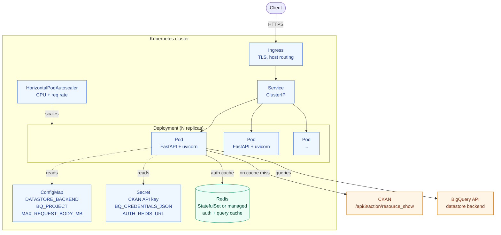
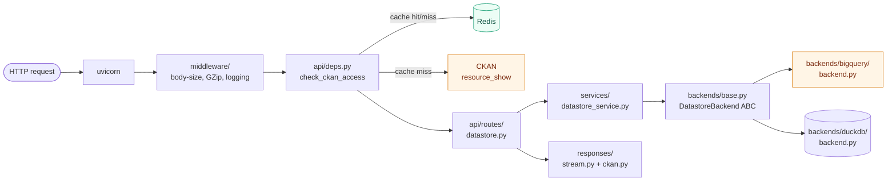

# Datastore API Service
A CKAN-compatible datastore API. Tabular data CRUD + search over a pluggable
storage backend (BigQuery Datastore or Ducklake as future support). 

---

## 1. Goals

- CKAN-compatible request/response shapes for `/api/3/datastore_*`.
- Pluggable backend selected by `DATASTORE_BACKEND` env var (`duckdb` or `bigquery`).
- Streaming responses for search (peak memory ≈ 1 row).
- Strict request validation, structured error responses.
- CKAN-based auth gate with Redis-cached decisions.


## 2. Technology Stack

| Concern | Choice | Why |
|---|---|---|
| Web framework | **FastAPI** (`fastapi[standard]`) | Async, OpenAPI for free, dependency injection |
| ASGI server | **uvicorn** + `uvloop` + `httptools` | Fast async I/O |
| Validation | **Pydantic v2** (request only) | Strict shape validation, no per-row cost |
| JSON | **orjson** | 5–10× stdlib `json`, returns bytes, datetime-aware |
| Datastore backend | **google-cloud-bigquery** | Managed, cached, scalable |
| HTTP client | **httpx** (`AsyncClient`) | Connection-pooled CKAN auth calls |
| Cache / auth store | **redis** + `hiredis` | TTL cache for auth decisions |
| Schema validation | **frictionless** | Field schema validation on `datastore_create` |


`pyproject.toml` dependencies (target):
```toml
[project]
dependencies = [
    "fastapi[standard]>=0.113,<0.114",
    "pydantic>=2.7,<3",
    "pydantic-settings>=2.3",
    "orjson>=3.10",
    "google-cloud-bigquery>=3.25",
    "redis[hiredis]>=5.0",
    "httpx>=0.27",
    "frictionless>=5.18",
    "uvloop>=0.21",
    "httptools>=0.6",
]

[tool.ruff.lint]
select = ["E", "F", "I"]

[tool.mypy]
strict = true
```

---

## 3. Folder Structure

```

datastore/
│
├── pyproject.toml                    # Dependencies, project metadata
├── README.md
├── .env.example                      # Template for env vars
├── .gitignore
├── Makefile                          # run, test, lint, format
├── docker-compose.yml                # postgres, redis, ckan, app
├── Dockerfile
│
├── src/
│   └── datastore/
│       ├── __init__.py
│       ├── main.py                   # FastAPI app + lifespan + router include
│       ├── config.py                 # Pydantic Settings (env-driven)
│       ├── container.py              # Wires engines, CKAN, cache → use cases
│       │
│       │ ── 1. API LAYER ────────────────────────────────
│       ├── api/
│       │   ├── __init__.py
│       │   ├── routes.py             # All 8 endpoints
│       │   ├── schemas.py            # Pydantic request/response models
│       │   ├── deps.py               # Auth + engine selection dependencies
│       │   └── errors.py             # Exception → HTTP handlers
│       │
│       │ ── 2. APPLICATION LAYER ────────────────────────
│       ├── application/
│       │   ├── __init__.py
│       │   ├── use_cases.py          # 8 use case classes
│       │   ├── ports.py              # EnginePort, CKANPort, CachePort
│       │   └── access_control.py     # Permission checks via CKAN
│       │
│       │ ── 3. DOMAIN LAYER ────────────────────────────
│       ├── domain/
│       │   ├── __init__.py
│       │   ├── models.py             # Dataset, Field, Record, Query
│       │   ├── rules.py              # Identifier + query validation
│       │   └── errors.py             # Domain exceptions
│       │
│       │ ── 4. INFRASTRUCTURE LAYER ────────────────────
│       └── infrastructure/
│           ├── __init__.py
│           ├── cache.py              # RedisCache + InMemoryCache (one file)
│           ├── ckan_client.py        # CKAN HTTP integration
│           └── engines/
│               ├── __init__.py
│               ├── base.py           # Shared helpers
│               ├── registry.py       # Engine factory by name
│               ├── bigquery.py
│               ├── postgres.py
│               └── ducklake.py
│
├── tests/
│   ├── __init__.py
│   ├── conftest.py                   # Fixtures: app, fake engines, fake CKAN, in-memory cache
│   ├── test_domain.py                # Pure rule tests
│   ├── test_use_cases.py             # With fakes
│   └── test_api.py                   # End-to-end HTTP tests
│
├── scripts/
│   ├── run_local.sh
│   └── seed_dev_data.py
│
└── docs/
    ├── architecture.md               # Layer diagram + dependency rule
    ├── adding-an-engine.md           # How to plug in a new backend
    └── api.md                        # Endpoint reference
```
---

## 4. Architecture



Inside each pod:



**Layer responsibilities**

| Layer | Lives in | Knows about |
|---|---|---|
| HTTP | `api/routes/`, `api/schemas/`, `api/deps.py` | Request parsing, status codes, FastAPI |
| Business logic | `services/` | Domain rules, orchestration — no SQL, no HTTP |
| Domain | `domain/` | Field normalisation, error types, identifier validation |
| Storage | `backends/` | SQL dialect, connection management, row iterators |
| Response | `responses/` | orjson serialization, streaming, CKAN envelope, CSV/TSV |

**Key design rules**
- Routes call services; services call backends. Routes never touch SQL.
- `services/datastore_service.py` owns cross-cutting validation (e.g., `unique_key` ⊆ field ids) that requires context from multiple inputs.
- Backends return `SearchResult` with a **lazy row iterator of tuples** — never `list[dict]`.
- `responses/stream.py` converts the iterator to JSON/CSV bytes one row at a time. Peak memory ≈ 1 row regardless of result size.
- Pydantic is for **inbound** validation only (`api/schemas/`). Outbound responses are plain dicts → `orjson.dumps` → `Response`.
- One read-backend and one write-backend instance, created in `core/lifespan.py`. DuckDB: separate read-only connection for searches.

**Pod-level shape**
- One container per pod: the FastAPI app. Sidecars only for observability (e.g., OpenTelemetry collector).
- `livenessProbe` → `GET /health` (always 200 while the process is up).
- `readinessProbe` → `GET /ready` (200 only when both backends pass `healthcheck()`; pod pulled from Service when 503).
- `terminationGracePeriodSeconds: 30` so in-flight streaming responses drain before SIGKILL.
- Memory bounded by `MAX_REQUEST_BODY_MB` × concurrency for writes; search responses are O(1) peak memory.

**Cluster-level shape**
- `Deployment` with N replicas, fronted by a `ClusterIP` `Service`.
- `Ingress` (NGINX, Traefik, etc.) terminates TLS and routes by host/path.
- `HorizontalPodAutoscaler` on CPU + custom metric (request rate).
- Config: non-secret env vars in `ConfigMap` (`DATASTORE_BACKEND`, `MAX_REQUEST_BODY_MB`, `BQ_PROJECT`); secrets in `Secret` (CKAN API key, `BQ_CREDENTIALS_JSON`, `AUTH_REDIS_URL`).
- Redis as in-cluster `StatefulSet` or external managed instance — connection string from Secret.
- DuckDB backend requires single-replica `StatefulSet` + `PersistentVolumeClaim`; BigQuery backend supports horizontal `Deployment`.

---

## 5. API Surface

All datastore endpoints sit under `/api/3/`. Health endpoints at the root.

### 5.1 Health

| Method | Path | Purpose |
|---|---|---|
| GET | `/` | Welcome banner — `{"message": "..."}` |
| GET | `/health` | Liveness — always 200 if process is up |
| GET | `/ready` | Readiness — 200 if both backends pass `healthcheck()`, else 503 |

### 5.2 Datastore endpoints

All datastore endpoints accept the auth gate (`Depends(check_ckan_access)`).

| Method | Path | Body / Params | Response |
|---|---|---|---|
| POST | `/api/3/datastore_create` | `DatastoreCreateRequest` | `DatastoreCreateResponse` |
| GET | `/api/3/datastore_search` | query params | streaming JSON / CSV / TSV |
| POST | `/api/3/datastore_upsert` | `DatastoreUpsertRequest` | `DatastoreUpsertResponse` |
| GET | `/api/3/datastore_search_sql` | `sql`, `limit` | streaming JSON |
| POST | `/api/3/datastore_delete` | `DatastoreDeleteRequest` | `DatastoreDeleteResponse` |
| GET | `/api/3/datastore_info` | `resource_id` | `DatastoreInfoResponse` |

---

## 6. Request / Response Contracts

CKAN-style envelope: every response has `help`, `success`, and either `result` or `error`.

### 6.1 `POST /api/3/datastore_create`

Running example: an electricity balancing-market auction-results table. Used
consistently across the rest of §6 so the request → search → info round-trip
is easy to follow.

**Request**
```json
{
  "resource_id": "balancing_auction_results_2025",
  "fields": [
    {
      "id": "auction_id",
      "type": "integer",
      "info": {
        "title": "Auction ID",
        "description": "Unique auction identifier. Stable across all products auctioned in the same market window.",
        "comment": "MANDATORY",
        "example": "144",
        "unit": "N/A"
      }
    },
    {
      "id": "product_code",
      "type": "string",
      "info": {
        "title": "Product Code",
        "description": "Product mnemonic for the balancing service (e.g. DCL, DCH, FFR).",
        "example": "DCL"
      }
    },
    {
      "id": "delivery_start",
      "type": "datetime",
      "info": {
        "title": "Delivery Start (UTC)",
        "description": "First instant of the delivery window. Stored as UTC; clients render local time.",
        "example": "2025-11-04T16:00:00Z"
      }
    },
    {
      "id": "duration_minutes",
      "type": "integer",
      "info": {
        "title": "Delivery Duration",
        "description": "Length of the delivery window.",
        "unit": "minutes",
        "example": "30"
      }
    },
    {
      "id": "clearing_price_gbp_per_mwh",
      "type": "number",
      "info": {
        "title": "Clearing Price",
        "description": "Pay-as-cleared price for the auction. Negative values are possible during oversupply.",
        "unit": "GBP/MWh",
        "example": "47.82"
      }
    },
    {
      "id": "volume_mwh",
      "type": "number",
      "info": {
        "title": "Cleared Volume",
        "description": "Total volume cleared in this auction.",
        "unit": "MWh",
        "example": "120.0"
      }
    },
    {
      "id": "accepted",
      "type": "boolean",
      "info": {
        "title": "Accepted",
        "description": "Whether the bid cleared (true) or was rejected (false)."
      }
    },
    {
      "id": "bidder_metadata",
      "type": "object",
      "info": {
        "title": "Bidder Metadata",
        "description": "Free-form provider-specific metadata captured at submission time.",
        "comment": "Schema not enforced; kept opaque for downstream analytics."
      }
    }
  ],
  "unique_key": ["auction_id", "product_code"],
  "records": [
    {
      "auction_id": 144,
      "product_code": "DCL",
      "delivery_start": "2025-11-04T16:00:00Z",
      "duration_minutes": 30,
      "clearing_price_gbp_per_mwh": 47.82,
      "volume_mwh": 120.0,
      "accepted": true,
      "bidder_metadata": {"unit_id": "DRAX-1", "submission_lag_ms": 412}
    },
    {
      "auction_id": 144,
      "product_code": "DCH",
      "delivery_start": "2025-11-04T16:00:00Z",
      "duration_minutes": 30,
      "clearing_price_gbp_per_mwh": 51.10,
      "volume_mwh": 75.5,
      "accepted": true,
      "bidder_metadata": {"unit_id": "EDF-COTT-2", "submission_lag_ms": 280}
    }
  ]
}
```

- `resource_id` — SQL identifier, required.
- `fields` — non-empty; each entry contains:
  - `id` (or alias `name`) — column identifier; SQL-safe.
  - `type` — column type. Accepts Frictionless canonical (`integer`, `number`, `string`, `boolean`, `date`, `datetime`, `time`, `object`, `array`, `geopoint`, `geojson`, `any`) or SQL aliases (`int4`, `int8`, `bigint`, `varchar`, `text`, `float`, `double`, `numeric`, `bool`, `timestamp`, `json`, …) which are normalised to canonical on storage.
  - `info` — optional **data dictionary** for documentation. Free-form object; recognised keys: `title`, `description`, `comment`, `example`, `unit`, plus any custom metadata. Stored verbatim and round-tripped on `datastore_info`. The outer `type` is canonical; any `info.type` is treated as a hint and ignored. Whitespace in string values is trimmed.
- `unique_key` — string or list of strings; all entries must reference declared field ids. The example uses a composite key (`auction_id` + `product_code`) since one auction clears multiple products.
- `records` — optional; each record's keys must be a subset of declared field ids.
- `primary_key` — accepted for back-compat; emits deprecation warning.

**Response — 200**
```json
{
  "help": "<request URL>",
  "success": true,
  "result": {
    "resource_id": "balancing_auction_results_2025",
    "fields": [
      {"id": "auction_id",                 "type": "integer",  "info": {"title": "Auction ID", "...": "..."}},
      {"id": "product_code",               "type": "string",   "info": {"...": "..."}},
      {"id": "delivery_start",             "type": "datetime", "info": {"...": "..."}},
      {"id": "duration_minutes",           "type": "integer",  "info": {"...": "..."}},
      {"id": "clearing_price_gbp_per_mwh", "type": "number",   "info": {"...": "..."}},
      {"id": "volume_mwh",                 "type": "number",   "info": {"...": "..."}},
      {"id": "accepted",                   "type": "boolean",  "info": {"...": "..."}},
      {"id": "bidder_metadata",            "type": "object",   "info": {"...": "..."}}
    ],
    "primary_key": ["auction_id", "product_code"],
    "unique_key": ["auction_id", "product_code"],
    "records_inserted": 2
  }
}
```

### 6.2 `GET /api/3/datastore_search`

**Query params**
| Name | Type | Default | Notes |
|---|---|---|---|
| `resource_id` | str | — | required unless `q` supplied |
| `filters` | JSON-encoded object | `null` | `{"col": value}` or `{"col": [v1, v2]}` |
| `q` | str / JSON | `null` | full-text or per-column |
| `distinct` | bool | `false` | |
| `plain` | bool | `true` | |
| `language` | str | `"english"` | reserved |
| `limit` | int | `1000` | clamped to `[0, 10000]` |
| `offset` | int | `0` | |
| `fields` | comma-separated list | all | |
| `sort` | str | `null` | `"col asc, col2 desc"` |
| `include_total` | bool | `true` | runs `COUNT(*)` if true |
| `records_format` | str | `"objects"` | `objects` / `lists` / `csv` / `tsv` |

**Example request**

```
GET /api/3/datastore_search
    ?resource_id=balancing_auction_results_2025
    &filters={"product_code": "DCL", "accepted": true}
    &sort=delivery_start desc, clearing_price_gbp_per_mwh asc
    &fields=auction_id,product_code,delivery_start,clearing_price_gbp_per_mwh,volume_mwh
    &limit=100
    &offset=0
```

**Response (records_format=objects) — streamed**
```json
{
  "help": "...",
  "success": true,
  "result": {
    "fields": [
      {"id": "auction_id",                 "type": "integer"},
      {"id": "product_code",               "type": "string"},
      {"id": "delivery_start",             "type": "datetime"},
      {"id": "clearing_price_gbp_per_mwh", "type": "number"},
      {"id": "volume_mwh",                 "type": "number"}
    ],
    "records": [
      {"auction_id": 152, "product_code": "DCL", "delivery_start": "2025-11-05T18:30:00Z", "clearing_price_gbp_per_mwh": 39.40, "volume_mwh": 95.0},
      {"auction_id": 144, "product_code": "DCL", "delivery_start": "2025-11-04T16:00:00Z", "clearing_price_gbp_per_mwh": 47.82, "volume_mwh": 120.0}
    ],
    "total": 2,
    "_links": {
      "start": "https://example.com/api/3/datastore_search?resource_id=balancing_auction_results_2025&limit=100&offset=0",
      "next":  "https://example.com/api/3/datastore_search?resource_id=balancing_auction_results_2025&limit=100&offset=100",
      "prev":  null
    }
  }
}
```

`records_format=lists` returns each record as a positional array (column order matches `fields`).
`records_format=csv` / `tsv` return a streaming text body with the header row first.

### 6.3 `POST /api/3/datastore_upsert`

**Request — late-arriving correction to an auction result**
```json
{
  "resource_id": "balancing_auction_results_2025",
  "method": "upsert",
  "unique_key": ["auction_id", "product_code"],
  "records": [
    {
      "auction_id": 144,
      "product_code": "DCL",
      "delivery_start": "2025-11-04T16:00:00Z",
      "duration_minutes": 30,
      "clearing_price_gbp_per_mwh": 48.05,
      "volume_mwh": 120.0,
      "accepted": true,
      "bidder_metadata": {"unit_id": "DRAX-1", "submission_lag_ms": 412, "revision": 2}
    },
    {
      "auction_id": 153,
      "product_code": "FFR",
      "delivery_start": "2025-11-05T19:00:00Z",
      "duration_minutes": 60,
      "clearing_price_gbp_per_mwh": 32.40,
      "volume_mwh": 200.0,
      "accepted": false,
      "bidder_metadata": {"unit_id": "SSE-PEH-3", "rejection_reason": "above_cap"}
    }
  ],
  "calculate_record_count": false,
  "force": false
}
```

- `method`: `upsert` | `insert` | `update`. `upsert` and `update` require `unique_key`.
- `unique_key` (preferred) / `primary_key` (back-compat): which fields identify a row.
- `calculate_record_count`: if `true`, runs a `COUNT(*)` after the write — adds a query, off by default.
- `force`: bypasses optional client-side guards (reserved; backend-specific).

**Response**
```json
{
  "help": "...",
  "success": true,
  "rows_written": 2,
  "records": [
    {"auction_id": 144, "product_code": "DCL", "...": "..."},
    {"auction_id": 153, "product_code": "FFR", "...": "..."}
  ],
  "record_count": null
}
```

### 6.4 `GET /api/3/datastore_search_sql`

**Query params**: `sql` (required), `limit` (default 32000).

**Example request — daily clearing-price summary**
```
GET /api/3/datastore_search_sql?sql=
  SELECT
    DATE(delivery_start)            AS delivery_date,
    product_code,
    AVG(clearing_price_gbp_per_mwh) AS avg_price,
    SUM(volume_mwh)                 AS total_volume
  FROM balancing_auction_results_2025
  WHERE accepted = true
    AND delivery_start >= '2025-11-01'
  GROUP BY delivery_date, product_code
  ORDER BY delivery_date DESC, product_code
&limit=10000
```

**Response — streamed**
```json
{
  "help": "...",
  "success": true,
  "result": {
    "fields": [
      {"id": "delivery_date", "type": "date"},
      {"id": "product_code",  "type": "string"},
      {"id": "avg_price",     "type": "number"},
      {"id": "total_volume",  "type": "number"}
    ],
    "records": [
      {"delivery_date": "2025-11-05", "product_code": "DCL", "avg_price": 41.20, "total_volume": 1840.0},
      {"delivery_date": "2025-11-05", "product_code": "DCH", "avg_price": 49.75, "total_volume":  720.5},
      {"delivery_date": "2025-11-04", "product_code": "DCL", "avg_price": 47.82, "total_volume": 1200.0}
    ],
    "records_truncated": false
  }
}
```

### 6.5 `POST /api/3/datastore_delete`

**Request — purge rejected bids for a single auction window**
```json
{
  "resource_id": "balancing_auction_results_2025",
  "filters": {
    "auction_id": 144,
    "accepted": false
  },
  "force": false
}
```
Empty `filters` (or omitted) → the entire table is dropped.

**Response**
```json
{
  "help": "...",
  "success": true,
  "result": {"resource_id": "balancing_auction_results_2025"}
}
```

### 6.6 `GET /api/3/datastore_info`

Returns the same field shape that was supplied to `datastore_create`, including
the `info` data dictionary verbatim — clients can use this as a column-level
metadata catalog (titles, descriptions, units, examples) without a side store.

**Response**
```json
{
  "help": "...",
  "success": true,
  "result": {
    "resource_id": "balancing_auction_results_2025",
    "fields": [
      {
        "id": "auction_id",
        "type": "integer",
        "info": {
          "title": "Auction ID",
          "description": "Unique auction identifier. Stable across all products auctioned in the same market window.",
          "comment": "MANDATORY",
          "example": "144",
          "unit": "N/A"
        }
      },
      {
        "id": "product_code",
        "type": "string",
        "info": {
          "title": "Product Code",
          "description": "Product mnemonic for the balancing service (e.g. DCL, DCH, FFR).",
          "example": "DCL"
        }
      },
      {
        "id": "delivery_start",
        "type": "datetime",
        "info": {
          "title": "Delivery Start (UTC)",
          "description": "First instant of the delivery window. Stored as UTC; clients render local time.",
          "example": "2025-11-04T16:00:00Z"
        }
      },
      {"id": "duration_minutes",           "type": "integer", "info": {"title": "Delivery Duration", "unit": "minutes"}},
      {"id": "clearing_price_gbp_per_mwh", "type": "number",  "info": {"title": "Clearing Price",    "unit": "GBP/MWh"}},
      {"id": "volume_mwh",                 "type": "number",  "info": {"title": "Cleared Volume",    "unit": "MWh"}},
      {"id": "accepted",                   "type": "boolean", "info": {"title": "Accepted"}},
      {"id": "bidder_metadata",            "type": "object",  "info": {"title": "Bidder Metadata"}}
    ],
    "unique_key": ["auction_id", "product_code"],
    "primary_key": ["auction_id", "product_code"],
    "record_count": 18420
  }
}
```

### 6.7 Error envelope (all 4xx / 5xx)

```json
{
  "help": "<request URL>",
  "success": false,
  "error": {
    "__type": "Validation Error",
    "message": "fields[0].id is not a valid identifier: '1bad'",
    "fields": {"fields": ["..."]}    // optional, present on validation errors
  }
}
```

`__type` taxonomy: `Validation Error` (400), `Authorization Error` (403),
`Not Found Error` (404), `Conflict Error` (409), `Internal Error` (500).

---

## 7. Execution Plan

Each phase is independently shippable, testable, and adds exactly one concern.
No phase breaks APIs delivered by previous phases.

---

### Global Execution Rules

Every phase must satisfy these before it can be called done:

| Invariant | Check |
|---|---|
| App starts | `uvicorn datastore.main:app` exits 0 |
| Health always works | `GET /health` → 200 |
| OpenAPI loads | `GET /docs` renders without error |
| No regression | All previous phase tests still pass |

Constraints:
- No backend logic before Phase 6
- No real streaming before Phase 9
- No Redis dependency before Phase 10

---

### Phase 0 — Foundation & Project Bootstrap

**Goal:** Production-grade project skeleton matching the §3 layout. Config, lifespan, error-handler wiring, and health endpoints — no business logic, no domain models, no engines.

**Files to create**

Project root
- `pyproject.toml` — deps from §2; `[tool.ruff.lint]`, `[tool.mypy]`, `[tool.pytest.ini_options]` (`testpaths = ["tests"]`, markers: `unit`, `integration`); `[tool.hatch.build.targets.wheel] packages = ["src/datastore"]`.
- `Dockerfile` — multi-stage: deps layer (`pip install`) + app layer (`COPY src/`); runs `uvicorn datastore.main:app --host 0.0.0.0 --port 8000`.
- `Makefile` — `run`, `test`, `lint`, `format` targets.
- `.env.example` — every var from `config.py` with a safe default.
- `.gitignore` — Python, venv, `.env`, `__pycache__`, `.pytest_cache`, `.ruff_cache`, `.mypy_cache`.
- `docker-compose.yml` — placeholder service for `app` (postgres/redis/ckan wired in later phases).

`src/datastore/` (each layer needs `__init__.py`)
- `main.py` — FastAPI app factory `create_app()`:
  - `lifespan` async context manager (stub — wires engines/Redis from Phase 6+).
  - Registers `GZipMiddleware` and a body-size guard (rejects `Content-Length > MAX_REQUEST_BODY_MB`).
  - Mounts the `api.routes` router.
  - Installs exception handlers from `api.errors`.
  - Module-level `app = create_app()` for uvicorn.
- `config.py` — `Settings(BaseSettings)` via `pydantic-settings` with `model_config = SettingsConfigDict(env_file=".env", extra="ignore")`. Fields: `APP_MESSAGE`, `MAX_REQUEST_BODY_MB=50`, `DATASTORE_ENGINE="bigquery"`, `BQ_PROJECT`, `REDIS_URL`, `CKAN_URL`, `LOG_LEVEL="INFO"`. Module-level constants: `DEFAULT_LIMIT=1000`, `MAX_LIMIT=10000`, `BATCH_SIZE=500`. `@lru_cache` `get_settings()`.
- `container.py` — empty stub class `Container` with a `TODO` comment; gets populated in Phase 4+ as engines/CKAN/cache come online.

`src/datastore/api/`
- `routes.py` — single `APIRouter` exposing:
  - `GET /` → `{"message": settings.APP_MESSAGE}`
  - `GET /health` → `{"status": "ok"}` (always 200 while process is up).
  - `GET /ready` → `{"status": "ready"}` (stub 200 until Phase 6 wires real `healthcheck()` calls).
- `errors.py` — `register_exception_handlers(app)`: minimal handler for unhandled `Exception` → 500 JSON `{"detail": "internal_error"}`. CKAN-envelope handlers land in Phase 3.
- `schemas.py`, `deps.py` — empty placeholders so layer is importable.

`src/datastore/{application,domain,infrastructure}/`
- Each layer just has `__init__.py` + a `# placeholder` comment file (e.g., `ports.py`, `models.py`, `engines/registry.py`) so the structure is committed and future imports won't fight `mypy --strict`.

`tests/`
- `conftest.py` — `client` fixture that yields a `TestClient(create_app())`.
- `test_api.py` — health-only tests for this phase (datastore tests added in Phase 1+).

**Done criteria**
- `uvicorn datastore.main:app --reload` starts with no errors.
- `GET /` → `{"message": "..."}` (200).
- `GET /health` → `{"status": "ok"}` (200).
- `GET /ready` → 200 (stub).
- `GET /docs` renders, shows the 3 health routes only.
- `ruff check src tests` clean; `mypy --strict src` clean.
- No imports from `application/`, `domain/`, `infrastructure/` in this phase.

**Tests** (`tests/test_api.py`)
- `test_welcome` — `GET /` returns `APP_MESSAGE`.
- `test_health` — `GET /health` returns 200 with valid JSON.
- `test_ready_stub` — `GET /ready` returns 200.
- `test_openapi_loads` — `GET /openapi.json` returns 200 and parses.

**Git**
```
chore: bootstrap datastore API project foundation
```

---

### Phase 1 — API Surface (Echo Mode)

**Goal:** Every CKAN endpoint exists and is reachable. No validation, no logic — each endpoint echoes its input back in a CKAN envelope.

**Files to create / update**

- `app/api/routes/datastore.py` — all 6 endpoints with stub bodies:
  ```python
  @router.post("/datastore_create")
  def datastore_create(request: Request, payload: dict = Body(...)):
      return json_response({
          "help": str(request.url), "success": True,
          "result": {"resource_id": payload.get("resource_id"), "stub": True},
      })
  ```
  Search + SQL endpoints return `StreamingResponse` with empty `records: []`.
- `app/responses/base.py` — `json_response(payload)` wraps `orjson.dumps` in `Response`.
- `app/api/router.py` — mount `datastore` router under `/api/3`; no auth dependency yet.
- OpenAPI `summary`, `description`, `responses` per endpoint (§6) — write now, cheapest time.

**Endpoints**

| Method | Path |
|---|---|
| POST | `/api/3/datastore_create` |
| GET | `/api/3/datastore_search` |
| POST | `/api/3/datastore_upsert` |
| GET | `/api/3/datastore_search_sql` |
| POST | `/api/3/datastore_delete` |
| GET | `/api/3/datastore_info` |

**Done criteria**
- All 6 endpoints return 200 with CKAN envelope `{"help":"...","success":true,"result":{...}}`.
- `/openapi.json` shows 6 datastore + 3 health endpoints.
- No Pydantic models on requests — `payload: dict = Body(...)`.

**Tests** (`tests/integration/api/`)
- `test_echo.py` — one test per endpoint: status 200, content-type `application/json`, top-level keys present.

**Git**
```
feat: implement CKAN API surface in echo mode
```

---

### Phase 2 — Request Validation (Strict CKAN + Frictionless)

**Goal:** Lock down the inbound contract. Every invalid request returns a structured CKAN error. Responses still return stubs — no backend calls.

**Files to create / update**

- `app/domain/resource_id.py` — `is_valid_identifier()`, `SqlIdentifier` annotated type.
- `app/domain/models.py`
  - `_normalise_field_type` — SQL aliases → Frictionless canonical (see §6.1 type list).
  - `to_ckan_type` — DB-reported type string → Frictionless canonical (used from Phase 6).
  - `resolve_unique_key` — `unique_key` wins over deprecated `primary_key`; normalise `str → list[str]`.
  - `_validate_with_frictionless` — calls `frictionless.Schema.from_descriptor`; raises `ValueError` on bad shape.
  - `_normalise_info` — strips whitespace from all string values in the `info` blob; drops `info.type` (outer `type` is canonical).
- `app/api/schemas/common.py` — `SqlIdentifier`, `UniqueKey`, `FieldSpec` (with `info` dict), CKAN envelope response types.
- `app/api/schemas/datastore.py` — Pydantic request models, all `model_config = {"extra": "forbid"}`:
  - `DatastoreCreateRequest` — cross-field: `unique_key` ⊆ declared field ids; record keys ⊆ field ids.
  - `DatastoreUpsertRequest` — cross-field: `unique_key` required when `method` ∈ {`upsert`, `update`}.
  - `DatastoreDeleteRequest`
  - Query-param dataclasses (not `BaseModel`): `SearchParams`, `SearchSQLParams`, `InfoParams`.
- `app/api/deps.py` — `get_search_params()`: clamps `limit` to `[0, MAX_LIMIT]`, validates `records_format` ∈ `{objects, lists, csv, tsv}`.
- `app/api/pagination.py` — `build_links(resource_id, limit, offset, total)` → `_links` dict.
- `app/middleware/error_handler.py` — maps `RequestValidationError` → CKAN `error.fields` map.
- Update `app/api/routes/datastore.py` — typed `DatastoreCreateRequest = Body(...)` etc.; stubs still return mocked data.
- Response Pydantic models on routes via `response_model=...` for `/docs` only — at runtime use `Response(orjson.dumps(...))`.

**Done criteria**
- POST `datastore_create` with `unique_key` referencing unknown field → 400, `error.__type == "Validation Error"`, `error.fields.unique_key` populated.
- POST `datastore_create` with an unrecognised top-level key → 400, message contains `Unknown field`.
- POST `datastore_upsert` with `method=update` and no `unique_key` → 400.
- `GET /docs` shows correct request + response schemas for all 6 endpoints.

**Tests**
- `tests/unit/domain/` — field normalisation, type alias mapping, `resolve_unique_key`, `_normalise_info`.
- `tests/unit/services/test_validation.py` — cross-field rules.
- Phase 0 + 1 tests still pass.

**Git**
```
feat: add strict request validation with Frictionless schema support
```

---

### Phase 3 — CKAN Response & Error System

**Goal:** All response paths — success and failure — return CKAN-compliant envelopes. No raw exceptions leak.

**Files to create / update**

- `app/domain/errors.py` — `APIError` base + `ValidationError` (400), `AuthorizationError` (403), `NotFoundError` (404), `ConflictError` (409), `ServerError` (500).
- `app/middleware/error_handler.py`
  - `APIError` → CKAN error envelope with `__type` from error class.
  - `HTTPException` → CKAN envelope, `__type` derived from status code.
  - `RequestValidationError` → CKAN `error.fields` map (updates Phase 2 scaffold).
- `app/responses/formats/ckan.py` — `ckan_success(help, result)`, `ckan_error(help, type, message, fields=None)`.

Error envelope shape (see §6.7):
```json
{
  "help": "<url>",
  "success": false,
  "error": {"__type": "Validation Error", "message": "...", "fields": {}}
}
```

**Done criteria**
- Any unhandled exception → 500 with CKAN error envelope, no stack trace in response body.
- `raise ValidationError("bad field")` inside a route → 400 CKAN envelope.
- All previous tests pass.

**Tests**
- `tests/unit/domain/test_errors.py` — each error class maps to the correct status + `__type`.
- `tests/integration/api/test_error_envelope.py` — force each error type via a test route; assert envelope shape.

**Git**
```
feat: implement CKAN response and error envelope system
```

---

### Phase 4 — Auth Layer (CKAN resource_show + Redis cache)

**Goal:** Every datastore endpoint is gated by a CKAN auth check. Redis caches decisions to avoid a round-trip per request.

**Files to create**

- `app/cache/redis.py` — `ConnectionPool` init/shutdown; `get_redis()` FastAPI dependency.
- `app/services/auth_service.py`
  1. Extract `api_key` from `Authorization` header or `api_key` query param.
  2. Check Redis: `auth:{api_key}:{resource_id}` → `allow` / `deny`.
  3. On miss: `GET {CKAN_URL}/api/3/action/resource_show?id={resource_id}` via `httpx.AsyncClient`. Cache result for `AUTH_CACHE_TTL` seconds.
  4. Fail-open if Redis is unavailable (call CKAN directly, skip caching).
- `app/api/deps.py` — `check_ckan_access` FastAPI dependency (wraps `auth_service`).
- `app/api/router.py` — add `dependencies=[Depends(check_ckan_access)]` to the datastore router.
- `app/core/config.py` — add `CKAN_URL`, `AUTH_CACHE_TTL` (default 300 s), `AUTH_ENABLED` (default `true`).

**Done criteria**
- Request without `Authorization` header → 403 CKAN envelope.
- Valid key + resource → 200 (passed through to stub response).
- Second identical request hits Redis (verify with `MONITOR` or spy on `auth_service`).
- `AUTH_ENABLED=false` bypasses auth entirely (for local dev without a CKAN instance).

**Tests**
- `tests/unit/services/test_auth_service.py` — cache hit, cache miss + CKAN call, CKAN 403, Redis failure fail-open.
- `tests/integration/api/test_auth.py` — missing key → 403; valid key (mock CKAN) → 200.

**Git**
```
feat: add CKAN auth layer with Redis caching
```

---

### Phase 5 — Service Layer (Business Logic Separation)

**Goal:** Routes contain zero logic. All orchestration lives in `services/`. Routes become one-liners: parse → call service → return response.

**Files to create / update**

- `app/services/datastore_service.py`
  - `create(resource_id, fields, key_fields, records) → dict`
  - `search(params: SearchParams) → SearchResult` (stub returns empty `SearchResult`)
  - `upsert(resource_id, records, method, key_fields, calculate_record_count) → dict`
  - `delete(resource_id, filters) → dict`
  - `info(resource_id) → dict`
  - `search_sql(sql, limit) → SearchResult` (stub)
  - Each method validates cross-cutting rules (e.g., field existence before upsert) then calls `self._backend.<method>()` — backend is injected via constructor, so service is fully unit-testable without a real DB.
- `app/api/routes/datastore.py` — routes become:
  ```python
  @router.post("/datastore_create")
  def datastore_create(payload: DatastoreCreateRequest, svc: DatastoreService = Depends(get_service)):
      result = svc.create(...)
      return json_response({"help": ..., "success": True, "result": result})
  ```
- `app/api/deps.py` — `get_service()` dependency: constructs `DatastoreService(backend=get_write_backend())`.

**Done criteria**
- Routes have no `if`, no SQL, no direct backend calls.
- `DatastoreService` can be unit-tested with a `Mock()` backend.
- All previous tests pass unchanged.

**Tests**
- `tests/unit/services/test_datastore_service.py` — each method with mock backend: correct args passed, cross-field rules enforced.

**Git**
```
refactor: introduce datastore service layer; routes become thin wrappers
```

---

### Phase 6 — Backend Abstraction (ABC + Factory)

**Goal:** The service layer calls a backend interface. The concrete backend is selected by `DATASTORE_BACKEND` env var. Both DuckDB and BigQuery implement the same ABC.

**Files to create**

- `app/backends/base.py`
  ```python
  @dataclass
  class SearchResult:
      fields: list[dict]            # [{"id": ..., "type": ..., "info": {...}}]
      row_iterator: Iterator[tuple] # lazy — never materialise all rows
      total: int | None = None
      records_truncated: bool = False

  @dataclass(slots=True)
  class WriteResult:
      rows_written: int = 0
      record_count: int | None = None

  class DatastoreBackend(ABC):
      @abstractmethod
      def initialize(self) -> None: ...
      @abstractmethod
      def healthcheck(self) -> bool: ...
      @abstractmethod
      def create(self, resource_id, fields, key_fields, records) -> WriteResult: ...
      @abstractmethod
      def search(self, *, resource_id, filters, q, distinct, plain, language,
                 limit, offset, fields, sort, include_total) -> SearchResult: ...
      @abstractmethod
      def upsert(self, resource_id, records, method, key_fields,
                 calculate_record_count) -> WriteResult: ...
      @abstractmethod
      def search_sql(self, sql, limit) -> SearchResult: ...
      @abstractmethod
      def delete(self, resource_id, filters) -> WriteResult: ...
      @abstractmethod
      def info(self, resource_id) -> dict: ...
      @abstractmethod
      def get_columns(self, resource_id) -> list[str]: ...
  ```
- `app/backends/factory.py` — `get_read_backend()` / `get_write_backend()` read `settings.DATASTORE_BACKEND`. Raise `ValueError` on unknown value.
- `app/core/lifespan.py` — now calls `read_backend.initialize()` / `write_backend.initialize()` on startup.
- `app/api/routes/health.py` — `/ready` now calls `read_backend.healthcheck()` + `write_backend.healthcheck()`; returns 503 if either fails.

**Done criteria**
- Swapping `DATASTORE_BACKEND=duckdb` ↔ `bigquery` switches the implementation; service is unaware.
- `GET /ready` → 503 when backend credentials are intentionally wrong; 200 when healthy.
- Unknown `DATASTORE_BACKEND` value → clear error on startup, not at request time.

**Tests**
- `tests/unit/backends/test_factory.py` — correct class returned per env var; unknown value raises.

**Git**
```
feat: implement pluggable DatastoreBackend ABC and factory
```

---

### Phase 7 — DuckDB Backend (Local Execution)

**Goal:** Fully working local system. `DATASTORE_BACKEND=duckdb` passes the complete CKAN flow.

**Files to create** (`app/backends/duckdb/`)

- `backend.py` — `DuckDBBackend` implementing all ABC methods.
  - `initialize()` — writer connection (`threading.Lock` guarded) + separate read-only connection. DuckLake if `DUCKLAKE_CATALOG` set; plain file at `DUCKDB_PATH` otherwise.
  - Type mapping: `integer→BIGINT`, `number→DOUBLE`, `string→VARCHAR`, `boolean→BOOLEAN`, `date→DATE`, `datetime→TIMESTAMP`, `time→TIME`, `object→JSON`, `array→JSON`.
  - `create()` — `CREATE TABLE IF NOT EXISTS`; `ALTER TABLE ADD COLUMN` for new columns; bulk-insert via multi-VALUES prepared statement.
  - `search()` — parameterized SELECT; full-text `q` as `LIKE` across VARCHAR columns; separate `COUNT(*)` if `include_total`; `cursor.fetchmany(BATCH_SIZE)` generator.
  - `upsert()` — `insert`: multi-VALUES INSERT. `update`: parameterized UPDATE per batch. `upsert`: `INSERT … ON CONFLICT DO UPDATE` (DuckDB ≥ 0.10).
  - `search_sql()` — `SELECT * FROM (<sql>) AS _q LIMIT ?`. Read-only connection; rejects any non-SELECT.
  - `delete()` — filtered `DELETE`; empty filters → `DROP TABLE IF EXISTS`.
  - `info()` — `INFORMATION_SCHEMA.COLUMNS`; `SELECT COUNT(*)` for record count.
  - `healthcheck()` — `SELECT 1`.
- `query_builder.py` — `build_where_clause(filters)`, `build_sort_clause(sort)`, `build_fts_clause(q, columns)`, type-mapping dict.

**Done criteria**
- Full CKAN flow end-to-end: `create → upsert → search → search_sql → delete → info`.
- Records round-trip exactly (type preservation).
- `search_sql()` rejects DML statements.

**Tests** (`tests/integration/backends/`)
- `test_duckdb.py` — full flow against an in-memory DuckDB (`:memory:`); no files written during CI.
- `tests/unit/backends/test_duckdb_query_builder.py` — SQL generation unit tests (no DB connection).

**Git**
```
feat: implement DuckDB backend (full local execution)
```

---

### Phase 8 — BigQuery Backend (Production)

**Goal:** Same CKAN flow works on BigQuery. `DATASTORE_BACKEND=bigquery` is the production path.

**Files to create** (`app/backends/bigquery/`)

- `backend.py` — `BigQueryBackend` implementing all ABC methods.
  - `initialize()` — `bigquery.Client(project=BQ_PROJECT)` once; credentials from `BQ_CREDENTIALS_JSON` env or ADC. Table names: `` `{BQ_PROJECT}.{BQ_DATASET}.{resource_id}` ``.
  - Type mapping: `integer→INT64`, `number→FLOAT64`, `string→STRING`, `boolean→BOOL`, `date→DATE`, `datetime→TIMESTAMP`, `time→TIME`, `object→JSON`.
  - `create()` — `CREATE TABLE IF NOT EXISTS`. Stores `unique_key` + per-field `info` dicts in the table description as JSON (`{"unique_key":[...],"field_info":{"col":{...}}}`); 16 KB cap — reject oversized payloads. Also writes `info.description` to BQ native column descriptions (≤ 1024 chars). Seed records via `insert_rows_json` (<500 rows) or DML `INSERT`.
  - `search()` — parameterised SQL (`@param`). Native BQ query cache on by default (do not set `use_query_cache=False`). Separate `COUNT(*)` if `include_total`. `query_job.result()` paged iterator → yield tuples.
  - `upsert()` — `insert`: `insert_rows_json` or DML `INSERT` for >500. `update`: DML `UPDATE WHERE key IN @keys`. `upsert`: `MERGE` with `UNNEST(@records)` source.
  - `search_sql()` — `SELECT * FROM (<user_sql>) AS _q LIMIT @limit`; parameterised `@limit`.
  - `delete()` — DML `DELETE WHERE …`; empty filters → `DROP TABLE IF EXISTS`.
  - `info()` — `INFORMATION_SCHEMA.COLUMNS`; record count from `__TABLES__` (no full scan) or `COUNT(*)`.
  - `healthcheck()` — `client.query("SELECT 1").result()`.
- `query_builder.py` — BigQuery-dialect WHERE/SORT/FTS clauses, `MERGE` template, type-mapping dict.

**Done criteria**
- Same integration flow as Phase 7 passes against a sandbox BigQuery dataset.
- Second identical `search` call shows `cache_hit=true` in BQ job metadata.
- `MERGE` upsert of 1 000 rows completes in a single BQ job.

**Tests** (`tests/integration/backends/`)
- `test_bigquery.py` — same parametrised suite as DuckDB; **skipped** when `BQ_CREDENTIALS_JSON` is absent.
- `tests/unit/backends/test_bigquery_query_builder.py` — SQL generation unit tests (no BQ connection).

**Git**
```
feat: implement BigQuery backend (production storage)
```

---

### Phase 9 — Streaming Engine

**Goal:** Search responses stream one row at a time. Peak memory ≈ 1 row regardless of result size. All output formats (JSON objects, lists, CSV, TSV) supported.

**Files to create / update**

- `app/responses/stream.py`
  - `stream_search(result, include_total, resource_id, limit, offset, help_text, records_format)` — yields bytes:
    1. Open envelope + `fields` array.
    2. For each tuple in `result.row_iterator`: `orjson.dumps(dict(zip(columns, row)))` — create dict inline, serialize, discard.
    3. `total` (if `include_total`).
    4. `_links` via `pagination.build_links(...)`.
    5. Close envelope.
  - `stream_search_sql(result)` — JSON only; includes `records_truncated`.
  - `stream_csv(result)` / `stream_tsv(result)` — header row first; each data row as CSV/TSV bytes.
- `app/responses/serialization.py` — `orjson` custom default handler for `datetime`, `Decimal`, `UUID`.
- `app/api/routes/datastore.py` — `datastore_search` and `datastore_search_sql` return `StreamingResponse`; `media_type` switches on `records_format`.
- `terminationGracePeriodSeconds: 30` in k8s Deployment spec (allows in-flight streams to drain).

**Done criteria**
- `datastore_search` on 1M rows peaks under 200 MB RSS (verify with `memory_profiler` or `tracemalloc`).
- `records_format=csv` output parses cleanly with Python's `csv.reader`.
- `records_format=lists` output is a valid JSON array of arrays.
- JSON output is valid end-to-end (open envelope + records + close without buffering).

**Tests**
- `tests/unit/responses/test_stream.py` — streaming serializer unit tests with a 100-row fake iterator: check envelope shape, row count, `_links` values, CSV header row.
- `tests/integration/api/test_streaming.py` — full HTTP streaming test via `httpx` streaming client; assert no full-body buffering.

**Git**
```
feat: add streaming query engine (orjson, CSV/TSV, 1-row memory footprint)
```

---

### Phase 10 — Redis Caching Layer

**Goal:** Repeated auth decisions hit Redis instead of CKAN. Optional lightweight query-result cache for small hot queries.

**Files to create / update**

- `app/cache/cache.py`
  - Auth cache: `auth:{api_key}:{resource_id}` → `allow` / `deny`, TTL = `AUTH_CACHE_TTL`.
  - Query cache (opt-in): `query:{resource_id}:{generation}:{sha256(params)}` → serialised result bytes. TTL = `QUERY_CACHE_TTL`. Only caches results < `QUERY_CACHE_MAX_BYTES` (default 50 KB) — BigQuery native cache covers large results.
  - Generation counter: `gen:{resource_id}` — `INCR` on every write. Cache keys embed generation so stale entries expire without explicit deletion.
- `app/core/config.py` — add `QUERY_CACHE_ENABLED` (default `false`), `QUERY_CACHE_TTL` (default 300), `QUERY_CACHE_MAX_BYTES` (default 51200).

**Done criteria**
- Two identical `datastore_search` calls (with `QUERY_CACHE_ENABLED=true`): second call shows Redis HIT in logs.
- `datastore_upsert` increments `gen:{resource_id}` → next search misses cache → fresh query.
- Redis failure → fail-open: request succeeds, cache skipped.

**Tests**
- `tests/unit/cache/test_cache.py` — cache hit/miss/invalidation logic; generation counter increment; size threshold.

**Git**
```
feat: add Redis query cache with generation-based invalidation
```

---

### Phase 11 — Observability & Production Hardening

**Goal:** Structured logs, request tracing, and all production k8s probes wired correctly.

**Files to create / update**

- `app/core/logging.py` — JSON structured logs; inject `request_id` (UUID per request) into every log line.
- `app/middleware/logging.py` — per-request log: `method`, `path`, `status`, `duration_ms`, `request_id`.
- `app/api/routes/health.py` — `/ready` exercises both backend `healthcheck()` methods; returns 503 when either fails.
- `k8s/deployment.yaml` (or Helm values) — `livenessProbe` → `/health`, `readinessProbe` → `/ready`, `terminationGracePeriodSeconds: 30`.

**Done criteria**
- Every request log line contains `request_id`, `method`, `path`, `status`, `duration_ms`.
- `/ready` → 503 when `BQ_CREDENTIALS_JSON` is intentionally wrong.
- `/ready` → 200 after credentials are corrected without restarting the app.

**Git**
```
chore: add structured logging, request tracing, and production probes
```

---

### Final State

After Phase 11 the system has:

| Capability | Delivered in |
|---|---|
| CKAN-compatible 6-endpoint API | Phase 1 |
| Strict validation + Frictionless schema | Phase 2 |
| CKAN error envelopes | Phase 3 |
| Redis-cached CKAN auth gate | Phase 4 |
| Testable service layer | Phase 5 |
| Pluggable backend (env-var switch) | Phase 6 |
| DuckDB backend (local / DuckLake) | Phase 7 |
| BigQuery backend (production) | Phase 8 |
| 1-row memory streaming + CSV/TSV | Phase 9 |
| Redis query cache | Phase 10 |
| Structured logs + k8s probes | Phase 11 |