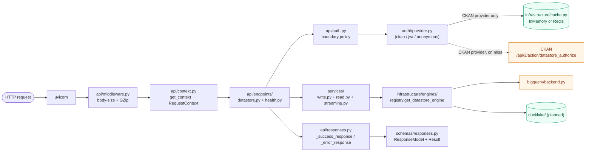

# Datastore API Service
A CKAN-compatible datastore API. Tabular data CRUD + search over a pluggable
storage backend (BigQuery Datastore or Ducklake as future support). 

---

## 1. Goals

- CKAN-compatible request/response shapes for `/api/3/action/datastore_*`.
- **Pluggable storage backend** selected by `DATASTORE_ENGINE` (`bigquery` today; `ducklake` planned).
- **Pluggable auth** selected by `AUTH_TYPE` (`ckan` / `jwt` / `anonymous`). Provider lives in `datastore/auth/<name>/`; only the CKAN provider touches the network, and its TTL cache is local to that provider.
- **Standalone-capable** — runs without an upstream CKAN under `AUTH_TYPE=anonymous` or `AUTH_TYPE=jwt`. CKAN is only required when `AUTH_TYPE=ckan`.
- **Streaming search responses** (peak memory ≈ 1 row) for `datastore_search` / `datastore_search_sql`.
- Strict request validation, structured CKAN-shaped error envelopes.


## 2. Technology Stack

| Concern | Choice | Why |
|---|---|---|
| Web framework | **FastAPI** (`fastapi[standard]`) | Async, OpenAPI for free, dependency injection |
| ASGI server | **uvicorn** + `uvloop` + `httptools` | Fast async I/O |
| Validation | **Pydantic v2** (request only) | Strict shape validation, no per-row cost |
| JSON | **orjson** | 5–10× stdlib `json`, returns bytes, datetime-aware |
| Datastore backend | **google-cloud-bigquery** | Managed, cached, scalable |
| HTTP client | **httpx** (`AsyncClient`) | Connection-pooled CKAN calls |
| Cache | **redis** + `hiredis` | TTL cache for CKAN auth decisions |
| Schema validation | **frictionless** | Field schema validation on `datastore_create` |
| SQL parsing | **sqlglot** | Parse `datastore_search_sql` — pull table + function names for the auth + allow-list gates |
| JWT auth | **PyJWT** | HS*/RS*/ES* signature + `aud`/`iss`/`exp` validation for the JWT provider |


`pyproject.toml` dependencies (live):
```toml
[project]
dependencies = [
    "fastapi[standard]>=0.115,<0.116",
    "pydantic>=2.7,<3",
    "pydantic-settings>=2.3",
    "orjson>=3.10",
    "google-cloud-bigquery>=3.25",
    "redis[hiredis]>=5.0",
    "httpx>=0.27",
    "frictionless>=5.18",
    "uvloop>=0.21",
    "httptools>=0.6",
    "sqlglot>=25.0",
    "pyjwt>=2.8,<3",
]

[tool.ruff.lint]
select = ["E", "F", "I"]

[tool.mypy]
strict = true
```

---

## 3. Folder Structure

**Stack split.** Two libraries do most of the heavy lifting and each has one
home in the tree:

- **Starlette** — the web part. Lives in `datastore/api/` and `datastore/main.py`. Everything that
  touches `Request`, `Response`, `StreamingResponse`, middleware, status codes,
  routing, or `Depends` lives here. Nothing else imports from `fastapi` or
  `starlette`.
- **Pydantic** — the data part. Lives in `datastore/schemas/` (request/response
  models) and `datastore/core/config.py` (`BaseSettings`). Used for **boundary
  validation only** — never as the internal data type passed between services
  or returned from engines (those use plain dicts, dataclasses, and tuples to
  keep per-row cost at zero).

### Layer rule

```
api  ──▶  services  ──▶  infrastructure
 │           │                 ▲
 ├──▶  auth  ─────────────────┤
 │                            │
 └──▶  schemas ◀──────────────┘     (schemas = Pydantic models, plain data)
```

One-way dependencies. `infrastructure/` never imports from `api/`,
`services/`, or `auth/`. `services/` and `auth/` never import from
`api/`. `api/` is the only layer that knows about FastAPI/Starlette.
`auth/` may use `infrastructure/` adapters (the CKAN provider needs
`CKANClient`, all providers may use `CachePort`).

### Tree

```
datastore-api/
│
├── pyproject.toml                    # Project metadata + deps + tool config
├── README.md
├── CLAUDE.md                         # This document — design + execution plan
├── .env.example                      # Template for env vars (every Config field)
├── .gitignore
├── Makefile                          # run, test, lint, format
├── docker-compose.yml                # local: app + redis + ckan
├── Dockerfile
│
├── datastore/
│   ├── __init__.py
│   ├── main.py                       # FastAPI app factory: create_app() +
│   │                                 # lifespan (httpx client, cache, ckan client);
│   │                                 # registers middleware + exception handlers;
│   │                                 # module-level `app = create_app()` for uvicorn.
│   │
│   │ ── 1. API LAYER ─────────────────────────  (FastAPI + Starlette live here)
│   ├── api/
│   │   ├── __init__.py
│   │   ├── routes.py                 # Top-level APIRouter; mounts endpoints/
│   │   ├── context.py                # RequestContext + ContextDep — per-request
│   │   │                             # handles (config, api_key, auth_provider, ckan)
│   │   │                             # with an `.authorize()` method that delegates
│   │   │                             # to auth.py
│   │   ├── auth.py                   # Provider-agnostic boundary policy: permission
│   │   │                             # whitelist, resource_id XOR package_id rule,
│   │   │                             # anonymous-read rule. Delegates to the active
│   │   │                             # AuthProvider; no caching here (CKAN caches
│   │   │                             # internally — see datastore/auth/ckan/).
│   │   ├── responses.py              # CKAN envelope helpers (_success_response / _error_response)
│   │   │                             # + orjson-backed ORJSONResponse
│   │   ├── error_handlers.py         # APIError / HTTPException / RequestValidationError
│   │   │                             # → CKAN error envelope mapping
│   │   ├── middleware.py             # ASGI middleware (BodySizeLimitMiddleware today)
│   │   └── endpoints/                # One module per resource group
│   │       ├── __init__.py
│   │       ├── health.py             # /, /health, /ready (CKAN-shaped envelopes)
│   │       └── datastore.py          # /api/3/action/datastore_*
│   │
│   │ ── 2. AUTH PROVIDERS ───────────────────────  (one subpackage per AUTH_TYPE)
│   ├── auth/
│   │   ├── __init__.py
│   │   ├── base.py                   # AuthProvider Protocol + Decision dataclass +
│   │   │                             # default_key_id (JWT jti / sha256 cache-key helper)
│   │   ├── registry.py               # get_auth_provider(config, **extras) —
│   │   │                             # importlib dispatch by AUTH_TYPE
│   │   ├── ckan/                     # AUTH_TYPE=ckan
│   │   │   ├── __init__.py           #   exports `Provider = CKANAuthProvider`
│   │   │   └── provider.py           #   datastore_authorize via CKANClient + TTL cache
│   │   ├── jwt/                      # AUTH_TYPE=jwt
│   │   │   ├── __init__.py           #   exports `Provider = JWTAuthProvider`
│   │   │   └── provider.py           #   PyJWT verify (HS*/RS*/ES* + aud/iss/exp)
│   │   └── anonymous/                # AUTH_TYPE=anonymous
│   │       ├── __init__.py           #   exports `Provider = AnonymousAuthProvider`
│   │       └── provider.py           #   always allows; no identity
│   │
│   │ ── 3. CORE (cross-cutting, framework-agnostic) ──────
│   ├── core/
│   │   ├── __init__.py
│   │   ├── config.py                 # Pydantic-Settings `Config` (env-driven) +
│   │   │                             # `get_config()` lru-cached factory
│   │   ├── constants.py              # Shared constants (POSTGRES_TYPES map)
│   │   ├── exceptions.py             # APIError taxonomy: ValidationError,
│   │   │                             # AuthorizationError, NotFoundError,
│   │   │                             # ConflictError, ServerError +
│   │   │                             # HTTP_STATUS_TO_TYPE_LABEL map
│   │   └── helper.py                 # Pure helpers (parse_authorization_header, …)
│   │
│   │ ── 4. SCHEMAS (Pydantic — boundary validation only) ──
│   ├── schemas/                      # Inbound request bodies + outbound response
│   │   ├── __init__.py               # types. Never passed between services or
│   │   ├── request.py                # returned from engines.
│   │   │                             #   request.py    – DatastoreCreateRequest,
│   │   │                             #                   DatastoreUpsertRequest,
│   │   │                             #                   DatastoreSearchRequest
│   │   ├── responses.py              #   responses.py  – ResponseModel base +
│   │   │                             #                   per-endpoint envelopes
│   │   │                             #                   (WelcomeResponse,
│   │   │                             #                   StatusResponse,
│   │   │                             #                   DatastoreCreateResponse)
│   │   └── validators.py             #   validators.py – FieldSpec, StringOrList,
│   │                                 #                   PostgresType, helper fns
│   │
│   │ ── 5. SERVICES (business logic, plain Python) ──────
│   ├── services/                     # Orchestration: validate → call engine →
│   │   ├── __init__.py               # shape result. Inputs: plain types or
│   │   ├── write.py                  # validated schemas. Outputs: typed response
│   │   │                             # models. No FastAPI, no raw SQL.
│   │   │                             #   write.py     – create / upsert / delete
│   │   ├── read.py                   #   read.py      – search / search_sql / info
│   │   │                             #                  (engine call, format
│   │   │                             #                  dispatch, pagination links,
│   │   │                             #                  function allow-list)
│   │   └── streaming.py              #   streaming.py – byte-yielding writers
│   │                                 #                  (objects/lists/csv/tsv)
│   │
│   │ ── 6. INFRASTRUCTURE (adapters to the outside world) ─
│   └── infrastructure/
│       ├── __init__.py
│       ├── cache.py                  # CachePort (Protocol) + InMemoryCache +
│       │                             # RedisCache (TTL-based)
│       ├── ckan_client.py            # CKANClient — httpx async wrapper around
│       │                             # CKAN /api/3/action; bind(api_key) per request
│       └── engines/                  # One subpackage per backend.
│           ├── __init__.py           # Re-exports get_datastore_engine, Mode
│           ├── base.py               # DatastoreBackend ABC +
│           │                         # SearchResult / WriteResult dataclasses
│           ├── registry.py           # get_datastore_engine + get_allowed_sql_functions;
│           │                         # dynamic `importlib` dispatch keyed on
│           │                         # context.config.DATASTORE_ENGINE
│           ├── bigquery/            # Engine package (one folder per backend).
│           |   ├── __init__.py       # Exports `Backend = BigQueryBackend` —
│           |   |                       # registry imports `Backend`, so the
│           |   |                       # concrete class name is engine-private.
│           |   ├── backend.py        # DatastoreBackend subclass (placeholder)
│           |   ├── client.py         # google-cloud-bigquery `Client` construction
│           |   ├── lib.py            # Backend-specific helpers (optional)
│           |   └── allowed_functions.txt  # Per-engine datastore_search_sql
│           |                               # function allow-list — one name per
│           |                               # line, `#` comments allowed.
│           └── ducklake/             # Future planned engine
└── tests/
    ├── __init__.py
    ├── conftest.py                   # FakeCKAN, InMemoryCache, TestClient fixture;
    │                                 # autouse _isolate_bigquery_env clears BQ envs;
    │                                 # CKAN pytest plugin disabled via pyproject
    ├── test_health.py
    ├── test_datastore_*.py           # End-to-end per endpoint (TestClient)
    ├── test_read_service.py          # Direct service calls — no HTTP
    ├── test_write_service.py
    ├── auth/                         # One folder per auth provider, mirrors datastore/auth/
    │   ├── test_base.py              # Decision + default_key_id
    │   ├── test_registry.py          # AUTH_TYPE dispatch
    │   ├── test_orchestration.py     # api/auth.py boundary policy
    │   ├── ckan/test_provider.py     # CKAN provider + TTL cache
    │   ├── jwt/test_provider.py
    │   └── anonymous/test_provider.py
    └── engines/
        ├── bigquery/test_*.py        # Real BigQuery backend, fully mocked
        └── ducklake/                 # (placeholder for future engine)
```

**Adding a new engine** — drop a sibling folder with the same layout
(`__init__.py` exports `Backend = <YourBackend>`; `backend.py` is the
`DatastoreBackend` subclass; `client.py` / `lib.py` for backend-specific
construction + helpers, both optional; `allowed_functions.txt` lists
allowed SQL functions). No edit to `registry.py` or `config.py` is
required — `DATASTORE_ENGINE` validates against the set of engine
subdirectories that exist at startup, and the factory dispatches via
`importlib.import_module` keyed off the `Backend` alias. The `ducklake`
adapter will live at `infrastructure/engines/ducklake/` when it lands.

`scripts/` and `docs/` are intentionally absent today. Add them when there's a concrete need
(seed scripts, operational runbooks). Until then the README + this file are the docs.

### What goes where — rules of thumb

| Folder | Put here | Do NOT put here |
|---|---|---|
| `datastore/main.py` | App factory, lifespan (httpx, cache, auth provider, engines), middleware order, handler registration | Routes, business logic |
| `datastore/api/endpoints/` | Route declarations, request parsing, response building | SQL, engine calls, validation rules — delegate to services |
| `datastore/api/context.py` | `RequestContext`, `ContextDep`, `get_context`, `get_auth_provider`, `get_ckan_client` (per-request DI bundle) | The logic those handles invoke — that lives in `services/` / `auth/` / `infrastructure/` |
| `datastore/api/auth.py` | Provider-agnostic boundary policy (permission whitelist, anonymous-read rule, resource_id XOR package_id) | Concrete provider behaviour — CKAN/JWT/anonymous logic lives in `datastore/auth/<name>/` |
| `datastore/api/responses.py` | CKAN envelope helpers, `ORJSONResponse` | Anything that needs DB access |
| `datastore/api/error_handlers.py` | Exception → CKAN error envelope mapping | Business rules — raise `APIError` from wherever the rule lives |
| `datastore/auth/<name>/` | Concrete `AuthProvider` implementation: `__init__.py` exports `Provider = <ConcreteClass>`; `provider.py` implements `authorize` + `key_id`. CKAN provider holds its own TTL cache. | Cross-provider policy (that's `api/auth.py`); FastAPI imports |
| `datastore/auth/base.py` | `AuthProvider` Protocol, `Decision` dataclass, `default_key_id` helper | Provider implementations |
| `datastore/auth/registry.py` | importlib factory keyed on `AUTH_TYPE` | Instance caching — the lifespan builds once and stashes on `app.state` |
| `datastore/core/` | Config (`Config`), exceptions, constants, pure helpers | I/O, FastAPI imports, business orchestration |
| `datastore/schemas/` | Pydantic `BaseModel` request / response / validator types | Methods that do work — schemas are data shapes only |
| `datastore/services/` | Validation that needs cross-input context, calls to engines/cache/CKAN, result shaping | `fastapi`/`starlette` imports, raw SQL strings, HTTP clients (call adapters) |
| `datastore/infrastructure/` | Adapters: cache (Redis / in-memory), CKAN HTTP client, storage engines (BigQuery / DuckLake) | Business rules, FastAPI types, orchestration, auth providers (those are at `datastore/auth/`) |
| `tests/` | Test code only — `tests/auth/<name>/` mirrors `datastore/auth/<name>/`; `tests/engines/<name>/` mirrors `datastore/infrastructure/engines/<name>/` | Fixtures that reach into production internals through back doors — go through the public API |

### Hard rules

1. **Only `datastore/api/` and `datastore/main.py` may import from `fastapi` or `starlette`.**
   Greppable invariant: `rg "from (fastapi|starlette)" datastore/services datastore/infrastructure datastore/core datastore/auth` must return nothing.
2. **Only `datastore/schemas/` and `datastore/core/config.py` may import from `pydantic` / `pydantic_settings`.**
   Engines, services, and auth providers pass plain dicts, tuples, and dataclasses.
3. **Engines return a lazy row iterator of tuples, never `list[dict]`.** Streaming
   peak memory ≈ 1 row regardless of result size.
4. **Pydantic validates at the boundary; orjson serialises out.** Don't use
   `model.model_dump()` on hot paths — build dicts inline and `orjson.dumps()`.
5. **Auth providers and storage engines are plugins, not registries to edit.** Drop a folder under `datastore/auth/<name>/` or `datastore/infrastructure/engines/<name>/` with `__init__.py` exporting `Provider` / `Backend`; `AUTH_TYPE` / `DATASTORE_ENGINE` are auto-validated against directories on disk. No `registry.py` or `config.py` edit required to add either.
6. **Auth caching is provider-private.** The only "auth cache" in the codebase is the TTL cache inside `datastore/auth/ckan/provider.py` (network round trip; worth caching). JWT and anonymous are local and never cache.
7. **No `container.py` / DI framework.** FastAPI's `Depends` plus the two `registry.py` factories (auth + engines) are the only wiring mechanisms.

---

## 4. Architecture

```mermaid
flowchart TB
    Client([Client])

    subgraph K8S["Kubernetes cluster"]
        direction TB
        Ingress["Ingress<br/>TLS, host routing"]
        Service["Service<br/>ClusterIP"]
        HPA["HorizontalPodAutoscaler<br/>CPU + req rate"]

        subgraph Deploy["Deployment (N replicas)"]
            direction LR
            Pod1["Pod<br/>FastAPI + uvicorn"]
            Pod2["Pod<br/>FastAPI + uvicorn"]
            PodN["Pod<br/>..."]
        end

        Config["ConfigMap<br/>DATASTORE_ENGINE<br/>BQ_PROJECT<br/>MAX_REQUEST_BODY_MB<br/>AUTH_CACHE_TTL"]
        Secret["Secret<br/>CKAN API key<br/>BQ_CREDENTIALS_JSON<br/>REDIS_URL"]
        Redis[("Redis<br/>StatefulSet or managed<br/>auth + query cache")]
    end

    CKAN["CKAN<br/>/api/3/action/datastore_authorize<br/>(only when AUTH_TYPE=ckan)"]
    BQ["BigQuery API<br/>datastore backend"]

    Client -->|HTTPS| Ingress
    Ingress --> Service
    Service --> Pod1
    Service --> Pod2
    Service --> PodN
    HPA -.scales.-> Deploy

    Pod1 -.reads.-> Config
    Pod1 -.reads.-> Secret
    Pod1 -->|auth cache (CKAN provider only)| Redis
    Pod1 -.->|on cache miss| CKAN
    Pod1 -->|queries| BQ

    classDef ext fill:#fff5e6,stroke:#d97706,color:#7c2d12
    classDef k8s fill:#eef6ff,stroke:#2563eb,color:#1e3a8a
    classDef store fill:#ecfdf5,stroke:#059669,color:#064e3b
    class CKAN,BQ ext
    class Ingress,Service,HPA,Pod1,Pod2,PodN,Config,Secret k8s
    class Redis store
```

Inside each pod:



**Layer responsibilities**

| Layer | Lives in | Knows about |
|---|---|---|
| HTTP | `api/endpoints/`, `api/routes.py`, `api/middleware.py` | Request parsing, status codes, FastAPI |
| Request bundle | `api/context.py` | Per-request handles: config, api_key, auth_provider, ckan (Optional). `.authorize()` method delegates to `api/auth.py` |
| Auth boundary policy | `api/auth.py` | Permission whitelist, anonymous-read rule, validation — provider-agnostic |
| Auth providers | `auth/<name>/` | One per `AUTH_TYPE`. CKAN (network + TTL cache), JWT (PyJWT verify), anonymous (no-op) |
| Response | `api/responses.py`, `schemas/responses.py` | CKAN envelope shape, orjson, typed result models |
| Errors | `api/error_handlers.py`, `core/exceptions.py` | APIError taxonomy → status code + `__type` label |
| Business logic | `services/` | Orchestration — no FastAPI, no raw SQL, no HTTP plumbing |
| Storage | `infrastructure/engines/` | Backend ABC + concrete adapters; SQL dialect, connection management, row iterators |
| External adapters | `infrastructure/cache.py`, `infrastructure/ckan_client.py` | TTL cache (InMemory / Redis), httpx-based CKAN client |
| Cross-cutting | `core/` | Config, constants, exceptions, pure helpers |

**Key design rules**
- Endpoints call `context.authorize(...)` then services; services call engines. Endpoints never touch SQL.
- `services/write.py` `datastore_create` is the only path that uses `context.ckan` (for `resource_create` on the dict-resource branch); the endpoint gates that branch on `AUTH_TYPE=ckan`. All other endpoints work standalone.
- Engines return `SearchResult` with a **lazy row iterator of tuples** — never `list[dict]`. Peak memory ≈ 1 row regardless of result size.
- Pydantic validates inbound (`schemas/request.py`) and documents outbound (`schemas/responses.py`). Outbound serialisation goes through `_success_response` → `ORJSONResponse` → orjson.
- The CKAN client is built once in the lifespan **only when `AUTH_TYPE=ckan`**; `get_context` binds the caller's `api_key` per request (a shallow `.bind(api_key)` copy). Under non-CKAN auth `app.state.ckan` is `None` and the per-request bound client is `None`.
- The auth provider is built once in the lifespan (with cache + cache_ttl + ckan client passed as kwargs); registry returns a fresh instance on every call so the lifespan owns instance reuse.
- No DI container. FastAPI's `Depends` + the two `registry.py` factories (auth + engines) are the only wiring mechanisms.

**Pod-level shape**
- One container per pod: the FastAPI app. Sidecars only for observability (e.g., OpenTelemetry collector).
- `livenessProbe` → `GET /health` (always 200 while the process is up).
- `readinessProbe` → `GET /ready` (200 only when both backends pass `healthcheck()`; pod pulled from Service when 503).
- `terminationGracePeriodSeconds: 30` so in-flight streaming responses drain before SIGKILL.
- Memory bounded by `MAX_REQUEST_BODY_MB` × concurrency for writes; search responses are O(1) peak memory.

**Cluster-level shape**
- `Deployment` with N replicas, fronted by a `ClusterIP` `Service`.
- `Ingress` (NGINX, Traefik, etc.) terminates TLS and routes by host/path.
- `HorizontalPodAutoscaler` on CPU + custom metric (request rate).
- Config: non-secret env vars in `ConfigMap` (`DATASTORE_ENGINE`, `MAX_REQUEST_BODY_MB`, `BQ_PROJECT`, `AUTH_CACHE_TTL`, `HTTP_TIMEOUT_SECONDS`); secrets in `Secret` (CKAN API key, `BQ_CREDENTIALS_JSON`, `REDIS_URL`).
- Redis as in-cluster `StatefulSet` or external managed instance — connection string from Secret. Empty `REDIS_URL` falls back to the in-process `InMemoryCache` (single-pod only).
- DuckLake backend will require single-replica `StatefulSet` + `PersistentVolumeClaim` (when implemented); BigQuery backend supports horizontal `Deployment`.

---

## 5. API Surface

All datastore endpoints sit under `/api/3/action/` to match the CKAN action API.
Health endpoints at the root.

### 5.1 Health

All three return the CKAN envelope shape `{help, success, result: {...}}`.

| Method | Path | Status | Result |
|---|---|---|---|
| GET | `/` | implemented | `{"message": APP_MESSAGE}` |
| GET | `/health` | implemented | `{"status": "ok"}` — liveness; always 200 if process is up |
| GET | `/ready` | implemented | `{"status": "ready"}` — calls `engine.healthcheck()` for rw + ro; 503 with a `Service Unavailable` envelope if either fails |

### 5.2 Datastore endpoints

Each endpoint takes a single `ContextDep`. The handler calls `context.authorize(...)` (which runs the boundary policy + delegates to the active `AuthProvider`) and then delegates to a service in `services/`.

| Method | Path | Status | Body / Params | Response model |
|---|---|---|---|---|
| POST | `/api/3/action/datastore_create` | **implemented** | `DatastoreCreateRequest` | `DatastoreCreateResponse` |
| POST | `/api/3/action/datastore_upsert` | **implemented** | `DatastoreUpsertRequest` | `DatastoreUpsertResponse` |
| POST | `/api/3/action/datastore_delete` | **implemented** | `DatastoreDeleteRequest` | `DatastoreDeleteResponse` |
| GET  | `/api/3/action/datastore_search` | **implemented** (streaming) | `DatastoreSearchRequest` | `DatastoreSearchResponse` |
| GET  | `/api/3/action/datastore_search_sql` | **implemented** (streaming) | `DatastoreSearchSQLRequest` | `DatastoreSearchResponse` |
| GET  | `/api/3/action/datastore_info` | **implemented** | `DatastoreInfoRequest` | `DatastoreInfoResponse` |
| GET  | `/datastore/dump/{resource_id}` | **implemented** | `format=csv\|ndjson\|parquet` | 302 → GCS *or* streaming body (see §5.3) |

The BigQuery engine is wired end-to-end: DDL, MERGE-based upsert, DML delete, parameterised search, native table-level metadata (the Frictionless schema + unique_key are JSON-encoded into the table's own `description` OPTION) for the schema round-trip, a row-count fast path via `INFORMATION_SCHEMA.TABLE_STORAGE`, and `EXPORT DATA`-backed dump with `table.modified`-keyed GCS caching. The DuckLake engine is the next concrete adapter — see §7.

`datastore_create` accepts two shapes:

- `resource_id` — table name only. Works under any `AUTH_TYPE`.
- `resource` (dict) — calls `ckan.resource_create(...)` first to materialise a CKAN resource, then writes the datastore table. The resource is created with `url_type="datastore"` so CKAN (and the read-only guard below) knows the datastore owns its data. **Only valid under `AUTH_TYPE=ckan`**; the endpoint rejects this shape with a `Validation Error` under JWT / anonymous since there's no CKAN to land it.

**Read-only guard (`AUTH_TYPE=ckan` only).** `datastore_create`, `datastore_upsert`, and `datastore_delete` refuse to write a resource whose CKAN record carries `url_type="datastore"` unless the request sets `force: true` — a `Validation Error` ("Cannot update a read-only resource. Use \"force\" to force update.") otherwise. This mirrors CKAN's protection against clobbering datastore-managed data by accident. The guard is gated on `AUTH_TYPE=ckan` and skipped entirely under any other provider (only the CKAN provider attaches a resource record).

### 5.3 `GET /datastore/dump/{resource_id}`

Full-table download, **one URL → one file** from the caller's point of view. Bytes never sit in API memory — small dumps redirect to GCS, large dumps stream-concat through async httpx.

Pipeline:

1. **Resolve cache key** — read `table.modified` from BigQuery, compute `rev = hex(microsec_epoch(modified))`, prefix becomes `dumps/<rid>/<fmt>/<rev>`.
2. **GCS cache lookup** — `list_blobs(prefix=…)`. Non-empty → skip steps 3-5; log `cache HIT`.
3. **Submit `EXPORT DATA`** — Parquet → single-file URI `gs://<bucket>/<prefix>.parquet`; CSV/NDJSON → wildcard URI `gs://<bucket>/<prefix>_*.<ext>` so BigQuery shards >1 GB exports. The SELECT casts `TIMESTAMP` + `DATETIME` columns to ISO 8601 for CSV/NDJSON; Parquet keeps native types.
4. **Poll non-blockingly** — `await asyncio.to_thread(job.reload)` + `await asyncio.sleep(_DUMP_POLL_INTERVAL_SECONDS)` between iterations. Worker thread is held only during the brief `reload` call, not the wait.
5. **GC stale revisions** — after a successful extract, sweep `dumps/<rid>/<fmt>/` and delete any blob that doesn't start with the current `prefix`. Best-effort, failures logged. Storage stays bounded to one rev per `(rid, fmt)`.
6. **Sign URLs** — V4 signed URLs with `response-content-disposition: attachment; filename="<rid>.<ext>"` (single shard) or `<rid>_NN.<ext>` (multi-shard, 1-indexed, zero-padded). Signing offloaded to a thread (IAM round-trip under workload identity).
7. **Return**:
   - 1 URL → `RedirectResponse(302)`. Bytes flow GCS → client; server is **out of the byte path**.
   - N URLs → `StreamingResponse` over `services.dump.stream_*_shards` (async httpx, 64 KiB chunks, serial shard walk, CSV header-dedup via `_skip_first_line`, NDJSON pure byte-concat).

Per-stream resource profile (multi-shard branch): ~64 KiB resident memory, **0** worker threads, byte-copy CPU only, async cancellation propagates from client disconnect → httpx → GCS connection released.

Errors:
- Parquet >1 GB → `EXPORT DATA` job fails with a "single URI / wildcard" message; classifier in `_is_export_too_large` flips it to `PayloadTooLargeError` (413). Caller switches to `format=csv` or `format=ndjson`.
- Any other BigQuery / GCS failure → `ServerError` (500) with the upstream message.
- `BIGQUERY_EXPORT_BUCKET` unset → `ServerError` at request time (the lifespan doesn't fail-fast because dump is an optional capability).

Required IAM. Dump follows a strict **ro for reading, rw for writing/updating** model — see [bigquery/client.py](datastore/infrastructure/engines/bigquery/client.py) `load_credentials` + `_build_bq_client` / `_build_storage_client` on the backend:

| Step | Identity | Why |
|---|---|---|
| `get_table` | RO BQ (`self.client`) | Reading BigQuery metadata. |
| `list_blobs` cache lookup | RO GCS | Reading GCS objects. |
| `client.query("EXPORT DATA …")` | RW BQ (built on demand) | BigQuery writes shards to GCS under this SA's identity — it's a write op even though the SQL surface is `SELECT`. |
| Post-extract `list_blobs` refresh | RW GCS | Blobs are passed straight to `generate_signed_url` next; we want them bound to the rw client. |
| `delete` (GC) | RW GCS | Writing/deleting objects. |
| `generate_signed_url` | RW GCS | Under workload identity this calls IAM `signBlob`, which typically only the rw SA holds via `iam.serviceAccountTokenCreator`. |

Concrete perm sets:

- **RO SA** (`BIGQUERY_CREDENTIALS_RO`) — `bigquery.tables.get` + `storage.objects.list`.
- **RW SA** (`BIGQUERY_CREDENTIALS`) — `bigquery.jobs.create` + `bigquery.tables.export` + `bigquery.tables.getData` + `storage.objects.{create,list,delete}` + `iam.serviceAccountTokenCreator`.

A single SA works if both perm sets land on the same identity — `BIGQUERY_CREDENTIALS_RO` empty falls through to ADC; same env var can drive both. `_build_bq_client` and `_build_storage_client` on the backend are deliberately small + stub-friendly so tests inject mocks without monkey-patching `google.cloud.*` globally.

A 24h object-lifecycle rule on the bucket is a useful belt-and-braces: the engine GCs older revs already, but lifecycle catches anything stranded by a crashed dump.

The GCS client is built with the same credentials as the BigQuery client for the active engine mode (`load_credentials(config, mode)` in [bigquery/client.py](datastore/infrastructure/engines/bigquery/client.py)). Without this shim, a service-account JSON loaded via `BIGQUERY_CREDENTIALS_RO` would drive BigQuery but `storage.Client(...)` would silently fall back to ADC — a near-invisible identity split. Workload identity / `GOOGLE_APPLICATION_CREDENTIALS`-style setups still work because `load_credentials` returns `None` for ADC and the storage client follows the same default-credentials path.

---

## 6. Request / Response Contracts

Every response is the CKAN envelope — `help`, `success`, and either `result` or `error`. The full per-endpoint reference (request bodies, query params, worked examples, and error shapes) lives in **[API.md](API.md)**.
CKAN-style envelope: every response has `help`, `success`, and either `result` or `error`.

### 6.1 `POST /api/3/datastore_create`

Running example: an electricity balancing-market auction-results table. Used
consistently across the rest of §6 so the request → search → info round-trip
is easy to follow.

**Request**
```json
{
  "resource_id": "balancing_auction_results_2025",
  "fields": [
    {
      "id": "auction_id",
      "type": "integer",
      "info": {
        "title": "Auction ID",
        "description": "Unique auction identifier. Stable across all products auctioned in the same market window.",
        "comment": "MANDATORY",
        "example": "144",
        "unit": "N/A"
      }
    },
    {
      "id": "product_code",
      "type": "string",
      "info": {
        "title": "Product Code",
        "description": "Product mnemonic for the balancing service (e.g. DCL, DCH, FFR).",
        "example": "DCL"
      }
    },
    {
      "id": "delivery_start",
      "type": "datetime",
      "info": {
        "title": "Delivery Start (UTC)",
        "description": "First instant of the delivery window. Stored as UTC; clients render local time.",
        "example": "2025-11-04T16:00:00Z"
      }
    },
    {
      "id": "duration_minutes",
      "type": "integer",
      "info": {
        "title": "Delivery Duration",
        "description": "Length of the delivery window.",
        "unit": "minutes",
        "example": "30"
      }
    },
    {
      "id": "clearing_price_gbp_per_mwh",
      "type": "number",
      "info": {
        "title": "Clearing Price",
        "description": "Pay-as-cleared price for the auction. Negative values are possible during oversupply.",
        "unit": "GBP/MWh",
        "example": "47.82"
      }
    },
    {
      "id": "volume_mwh",
      "type": "number",
      "info": {
        "title": "Cleared Volume",
        "description": "Total volume cleared in this auction.",
        "unit": "MWh",
        "example": "120.0"
      }
    },
    {
      "id": "accepted",
      "type": "boolean",
      "info": {
        "title": "Accepted",
        "description": "Whether the bid cleared (true) or was rejected (false)."
      }
    },
    {
      "id": "bidder_metadata",
      "type": "object",
      "info": {
        "title": "Bidder Metadata",
        "description": "Free-form provider-specific metadata captured at submission time.",
        "comment": "Schema not enforced; kept opaque for downstream analytics."
      }
    }
  ],
  "unique_key": ["auction_id", "product_code"],
  "records": [
    {
      "auction_id": 144,
      "product_code": "DCL",
      "delivery_start": "2025-11-04T16:00:00Z",
      "duration_minutes": 30,
      "clearing_price_gbp_per_mwh": 47.82,
      "volume_mwh": 120.0,
      "accepted": true,
      "bidder_metadata": {"unit_id": "DRAX-1", "submission_lag_ms": 412}
    },
    {
      "auction_id": 144,
      "product_code": "DCH",
      "delivery_start": "2025-11-04T16:00:00Z",
      "duration_minutes": 30,
      "clearing_price_gbp_per_mwh": 51.10,
      "volume_mwh": 75.5,
      "accepted": true,
      "bidder_metadata": {"unit_id": "EDF-COTT-2", "submission_lag_ms": 280}
    }
  ]
}
```

- `resource_id` — SQL identifier, required.
- `fields` — non-empty; each entry contains:
  - `id` (or alias `name`) — column identifier; SQL-safe.
  - `type` — column type. Accepts Frictionless canonical (`integer`, `number`, `string`, `boolean`, `date`, `datetime`, `time`, `object`, `array`, `geopoint`, `geojson`, `any`) or SQL aliases (`int4`, `int8`, `bigint`, `varchar`, `text`, `float`, `double`, `numeric`, `bool`, `timestamp`, `json`, …) which are normalised to canonical on storage.
  - `info` — optional **data dictionary** for documentation. Free-form object; recognised keys: `title`, `description`, `comment`, `example`, `unit`, plus any custom metadata. Stored verbatim and round-tripped on `datastore_info`. The outer `type` is canonical; any `info.type` is treated as a hint and ignored. Whitespace in string values is trimmed.
- `unique_key` — string or list of strings; all entries must reference declared field ids. The example uses a composite key (`auction_id` + `product_code`) since one auction clears multiple products.
- `records` — optional; each record's keys must be a subset of declared field ids.
- `primary_key` — accepted for back-compat; emits deprecation warning.

**Response — 200**
```json
{
  "help": "<request URL>",
  "success": true,
  "result": {
    "resource_id": "balancing_auction_results_2025",
    "fields": [
      {"id": "auction_id",                 "type": "integer",  "info": {"title": "Auction ID", "...": "..."}},
      {"id": "product_code",               "type": "string",   "info": {"...": "..."}},
      {"id": "delivery_start",             "type": "datetime", "info": {"...": "..."}},
      {"id": "duration_minutes",           "type": "integer",  "info": {"...": "..."}},
      {"id": "clearing_price_gbp_per_mwh", "type": "number",   "info": {"...": "..."}},
      {"id": "volume_mwh",                 "type": "number",   "info": {"...": "..."}},
      {"id": "accepted",                   "type": "boolean",  "info": {"...": "..."}},
      {"id": "bidder_metadata",            "type": "object",   "info": {"...": "..."}}
    ],
    "primary_key": ["auction_id", "product_code"],
    "unique_key": ["auction_id", "product_code"]
  }
}
```

Optional response fields (omitted from the body when not requested):
- `records` — echoes the input rows back when the request sets `include_records: true`.
- `total` — total row count after the write, populated when `include_total: true`.

### 6.2 `GET /api/3/datastore_search`

**Query params**
| Name | Type | Default | Notes |
|---|---|---|---|
| `resource_id` | str | — | required unless `q` supplied |
| `filters` | JSON-encoded object | `null` | `{"col": value}` or `{"col": [v1, v2]}` |
| `q` | str / JSON | `null` | full-text or per-column |
| `distinct` | bool | `false` | |
| `plain` | bool | `true` | |
| `language` | str | `"english"` | reserved |
| `limit` | int | `1000` | clamped to `[0, 10000]` |
| `offset` | int | `0` | |
| `fields` | comma-separated list | all | |
| `sort` | str | `null` | `"col asc, col2 desc"` |
| `include_total` | bool | `true` | runs `COUNT(*)` if true |
| `records_format` | str | `"objects"` | `objects` / `lists` / `csv` / `tsv` |

**Example request**

```
GET /api/3/datastore_search
    ?resource_id=balancing_auction_results_2025
    &filters={"product_code": "DCL", "accepted": true}
    &sort=delivery_start desc, clearing_price_gbp_per_mwh asc
    &fields=auction_id,product_code,delivery_start,clearing_price_gbp_per_mwh,volume_mwh
    &limit=100
    &offset=0
```

**Response (records_format=objects) — streamed**
```json
{
  "help": "...",
  "success": true,
  "result": {
    "fields": [
      {"id": "auction_id",                 "type": "integer"},
      {"id": "product_code",               "type": "string"},
      {"id": "delivery_start",             "type": "datetime"},
      {"id": "clearing_price_gbp_per_mwh", "type": "number"},
      {"id": "volume_mwh",                 "type": "number"}
    ],
    "records": [
      {"auction_id": 152, "product_code": "DCL", "delivery_start": "2025-11-05T18:30:00Z", "clearing_price_gbp_per_mwh": 39.40, "volume_mwh": 95.0},
      {"auction_id": 144, "product_code": "DCL", "delivery_start": "2025-11-04T16:00:00Z", "clearing_price_gbp_per_mwh": 47.82, "volume_mwh": 120.0}
    ],
    "total": 2,
    "_links": {
      "start": "https://example.com/api/3/action/datastore_search?resource_id=balancing_auction_results_2025&limit=100",
      "next":  "https://example.com/api/3/action/datastore_search?resource_id=balancing_auction_results_2025&limit=100&offset=100"
    }
  }
}
```

`_links` carries the same scheme + host as the request URL, with all
non-`offset` params preserved. `start` omits `offset` (it defaults to 0);
`next` advances `offset` by `limit`. Clients detect end-of-data by an
empty `records` array on the next page — there's no `prev` field today.

`records_format=lists` returns each record as a positional array (column order matches `fields`).
`records_format=csv` / `tsv` return a streaming text body with the header row first.

### 6.3 `POST /api/3/datastore_upsert`

**Request — late-arriving correction to an auction result**
```json
{
  "resource_id": "balancing_auction_results_2025",
  "method": "upsert",
  "unique_key": ["auction_id", "product_code"],
  "records": [
    {
      "auction_id": 144,
      "product_code": "DCL",
      "delivery_start": "2025-11-04T16:00:00Z",
      "duration_minutes": 30,
      "clearing_price_gbp_per_mwh": 48.05,
      "volume_mwh": 120.0,
      "accepted": true,
      "bidder_metadata": {"unit_id": "DRAX-1", "submission_lag_ms": 412, "revision": 2}
    },
    {
      "auction_id": 153,
      "product_code": "FFR",
      "delivery_start": "2025-11-05T19:00:00Z",
      "duration_minutes": 60,
      "clearing_price_gbp_per_mwh": 32.40,
      "volume_mwh": 200.0,
      "accepted": false,
      "bidder_metadata": {"unit_id": "SSE-PEH-3", "rejection_reason": "above_cap"}
    }
  ],
  "include_records": false,
  "include_total": false,
  "force": false
}
```

- `method`: `upsert` | `insert` | `update`. The table's stored `unique_key` (set at `datastore_create`) decides which rows match — the request body itself never carries it.
- `include_records`: if `true`, echoes the written rows back in the response.
- `include_total`: if `true`, the engine runs a `COUNT(*)` after the write and populates `result.total`. Off by default.
- `force`: bypasses optional client-side guards (reserved; backend-specific).

**Response**
```json
{
  "help": "...",
  "success": true,
  "result": {
    "resource_id": "balancing_auction_results_2025",
    "method": "upsert"
  }
}
```

Optional fields appear in `result` only when requested:

- `records` — echoes input rows when `include_records: true`.
- `total` — total row count after the write when `include_total: true`.

`null` is never serialised — fields that aren't populated are simply omitted (see `_orjson_default` in `api/responses.py`).

### 6.4 `GET /api/3/datastore_search_sql`

**Query params**: `sql` (required), `limit` (default 32000).

**Example request — daily clearing-price summary**
```
GET /api/3/datastore_search_sql?sql=
  SELECT
    DATE(delivery_start)            AS delivery_date,
    product_code,
    AVG(clearing_price_gbp_per_mwh) AS avg_price,
    SUM(volume_mwh)                 AS total_volume
  FROM balancing_auction_results_2025
  WHERE accepted = true
    AND delivery_start >= '2025-11-01'
  GROUP BY delivery_date, product_code
  ORDER BY delivery_date DESC, product_code
&limit=10000
```

**Response — streamed**
```json
{
  "help": "...",
  "success": true,
  "result": {
    "fields": [
      {"id": "delivery_date", "type": "date"},
      {"id": "product_code",  "type": "string"},
      {"id": "avg_price",     "type": "number"},
      {"id": "total_volume",  "type": "number"}
    ],
    "records": [
      {"delivery_date": "2025-11-05", "product_code": "DCL", "avg_price": 41.20, "total_volume": 1840.0},
      {"delivery_date": "2025-11-05", "product_code": "DCH", "avg_price": 49.75, "total_volume":  720.5},
      {"delivery_date": "2025-11-04", "product_code": "DCL", "avg_price": 47.82, "total_volume": 1200.0}
    ],
    "records_truncated": false
  }
}
```

### 6.5 `POST /api/3/datastore_delete`

**Request — purge rejected bids for a single auction window**
```json
{
  "resource_id": "balancing_auction_results_2025",
  "filters": {
    "auction_id": 144,
    "accepted": false
  },
  "force": false
}
```
Empty `filters` (or omitted) → the entire table is dropped. Passing `fields`
(mutually exclusive with `filters`) drops those columns instead of rows.

**Response**
```json
{
  "help": "...",
  "success": true,
  "result": {"resource_id": "balancing_auction_results_2025"}
}
```

When `fields` is supplied (column drop), `result` also carries `schema` — the
Frictionless Table Schema after the listed columns were removed — so the caller
can confirm the table's new shape without a follow-up `datastore_info`:

```json
{
  "help": "...",
  "success": true,
  "result": {
    "resource_id": "balancing_auction_results_2025",
    "fields": ["bidder_metadata"],
    "schema": {"fields": [{"id": "auction_id", "type": "integer"}, "..."], "primaryKey": ["auction_id", "product_code"]}
  }
}
```

### 6.6 `GET /api/3/datastore_info`

Returns the same field shape that was supplied to `datastore_create`, including
the `info` data dictionary verbatim — clients can use this as a column-level
metadata catalog (titles, descriptions, units, examples) without a side store.

**Response**
```json
{
  "help": "...",
  "success": true,
  "result": {
    "resource_id": "balancing_auction_results_2025",
    "fields": [
      {
        "id": "auction_id",
        "type": "integer",
        "info": {
          "title": "Auction ID",
          "description": "Unique auction identifier. Stable across all products auctioned in the same market window.",
          "comment": "MANDATORY",
          "example": "144",
          "unit": "N/A"
        }
      },
      {
        "id": "product_code",
        "type": "string",
        "info": {
          "title": "Product Code",
          "description": "Product mnemonic for the balancing service (e.g. DCL, DCH, FFR).",
          "example": "DCL"
        }
      },
      {
        "id": "delivery_start",
        "type": "datetime",
        "info": {
          "title": "Delivery Start (UTC)",
          "description": "First instant of the delivery window. Stored as UTC; clients render local time.",
          "example": "2025-11-04T16:00:00Z"
        }
      },
      {"id": "duration_minutes",           "type": "integer", "info": {"title": "Delivery Duration", "unit": "minutes"}},
      {"id": "clearing_price_gbp_per_mwh", "type": "number",  "info": {"title": "Clearing Price",    "unit": "GBP/MWh"}},
      {"id": "volume_mwh",                 "type": "number",  "info": {"title": "Cleared Volume",    "unit": "MWh"}},
      {"id": "accepted",                   "type": "boolean", "info": {"title": "Accepted"}},
      {"id": "bidder_metadata",            "type": "object",  "info": {"title": "Bidder Metadata"}}
    ],
    "unique_key": ["auction_id", "product_code"],
    "primary_key": ["auction_id", "product_code"],
    "total": 18420
  }
}
```

### 6.7 Error envelope (all 4xx / 5xx)

```json
{
  "help": "<request URL>",
  "success": false,
  "error": {
    "__type": "Validation Error",
    "message": "fields[0].id is not a valid identifier: '1bad'",
    "fields": {"fields": ["..."]}    // optional, present on validation errors
  }
}
```

`__type` taxonomy: `Validation Error` (400), `Authorization Error` (403), `Not Found Error` (404), `Conflict Error` (409), `Internal Error` (500).


## 7. Roadmap

The original phase plan that used to live here has mostly shipped. This section now tracks what's done, what's next, and the guardrails that apply to every change. For the current file layout see §3.

### Done

- [x] **Foundation** — `pyproject.toml`, `Dockerfile`, `Makefile`, `.env.example`, `docker-compose.yml`. App factory + lifespan in [datastore/main.py](datastore/main.py); body-size middleware in [datastore/api/middleware.py](datastore/api/middleware.py); startup log line via `uvicorn.error` showing the active engine + auth provider + cache backend.
- [x] **All six `datastore_*` actions wired** — `create`, `upsert`, `delete`, `search`, `search_sql`, `info` mounted via [datastore/api/routes.py](datastore/api/routes.py). Every endpoint authorizes via `context.authorize(...)` and delegates to a service.
- [x] **Real BigQuery backend** — [datastore/infrastructure/engines/bigquery/](datastore/infrastructure/engines/bigquery/) implements DDL, parameterised `search`, MERGE-based `upsert` (`method=upsert` / `insert` / `update`), DML `delete` (whole-table drop, row delete, column drop), parameterised `search_sql`, and `info`. Frictionless schema + `unique_key` round-trip via native table-level metadata — JSON-encoded into the table's own `description` OPTION (no separate metadata table). Row counts use the cheap `INFORMATION_SCHEMA.TABLE_STORAGE` fast path when filters don't apply.
- [x] **Streaming search** — [datastore/services/streaming.py](datastore/services/streaming.py) yields the CKAN envelope chunk-by-chunk for all four `records_format` values (`objects`, `lists`, `csv`, `tsv`); CSV/TSV ride the same JSON envelope (records is a multi-line string). Peak memory ≈ 1 row regardless of N. `_links.start` / `_links.next` carry full scheme + host with all non-`offset` params preserved.
- [x] **`datastore_search_sql` SQL safety** — schema rejects non-SELECT / multi-statement / unparseable SQL (sqlglot). [datastore/schemas/validators.py](datastore/schemas/validators.py)'s `parse_sql_references` pulls table + function names; endpoint authorizes each table as a `resource_id`; service rejects functions outside the engine's allow-list at `engines/<name>/allowed_functions.txt` (overridable via `SQL_FUNCTIONS_ALLOW_FILE`).
- [x] **Request validation** — Pydantic models in [datastore/schemas/request.py](datastore/schemas/request.py) with `extra="forbid"`. `datastore_info` / `datastore_delete` accept `resource_id` or `id` (normalised). Pydantic errors → CKAN error envelope with a `fields` map.
- [x] **Response models** — [datastore/schemas/responses.py](datastore/schemas/responses.py) — one envelope per endpoint with a nested `Result` class. Routes declare `response_model=...` for OpenAPI; services return the typed inner `Result`.
- [x] **Error envelope** — handlers in [datastore/api/error_handlers.py](datastore/api/error_handlers.py); taxonomy in [datastore/core/exceptions.py](datastore/core/exceptions.py).
- [x] **Pluggable auth providers** — `AUTH_TYPE` selects a folder under [datastore/auth/](datastore/auth/). Built-in: `ckan` (delegates to `datastore_authorize` with a provider-local TTL cache), `jwt` (PyJWT verify HS*/RS*/ES* + `aud`/`iss`/`exp`), `anonymous` (allow-all). Boundary policy in [datastore/api/auth.py](datastore/api/auth.py) is provider-agnostic. Adding a new provider = drop a folder; no registry / config edit.
- [x] **Standalone capability** — `CKANClient` is only constructed when `AUTH_TYPE=ckan`; `RequestContext.ckan` is `CKANClient | None`. `Config` validator rejects `AUTH_TYPE=ckan` + empty `CKAN_URL` at startup. `datastore_create` `resource` dict path is gated on CKAN auth; everything else runs without an upstream CKAN.
- [x] **`/ready` healthcheck** — lifespan builds rw + ro engine instances and stashes on `app.state`; `/ready` calls `engine.healthcheck()` on both and returns 503 + `Service Unavailable` envelope if either fails.
- [x] **Request context** — `RequestContext` + `ContextDep` in [datastore/api/context.py](datastore/api/context.py); CKAN client bound to the caller's `api_key` per request (or `None` under non-CKAN auth). `.authorize()` method delegates to `api/auth.py` policy + active provider.
- [x] **Engine + auth registries** — `DatastoreBackend` ABC + result dataclasses in [engines/base.py](datastore/infrastructure/engines/base.py); `AuthProvider` Protocol + `Decision` in [auth/base.py](datastore/auth/base.py). Each subpackage exports `Backend` / `Provider`; `DATASTORE_ENGINE` / `AUTH_TYPE` are validated against directories on disk at startup; registries dispatch via `importlib`.
- [x] **Postman collection** — [postman/collection.json](postman/collection.json) auto-generated from `example_payload/` by `postman/generate_postman.py`; covers every endpoint with a worked example.
- [x] **Tests** — ~290 tests across endpoint, service, auth provider, and engine layers. CKAN pytest plugin disabled via `addopts` in `pyproject.toml`.

### Next

Rough priority order. Tick each box as the change set lands.

- [ ] **DuckLake backend.** Second concrete engine implementing `DatastoreBackend`. Single-replica `StatefulSet` + `PersistentVolumeClaim` in k8s. Local mode reads `DUCKDB_PATH`; DuckLake mode reads a catalog URL.
- [ ] **Observability.** JSON structured logger in `core/logging.py`; per-request middleware in `api/middleware.py` injects a `request_id` and logs `method`, `path`, `status`, `duration_ms`. The existing `log.debug` lines in auth + error handlers + the CKAN provider light up under `LOG_LEVEL=DEBUG`.
- [ ] **Per-table SQL auth for `datastore_search_sql`** — today the endpoint authorizes each table the schema extracts via the active provider, but CKAN's `datastore_search_sql_authorize` is a separate action that takes the SQL string. Wire it through `context.ckan` for the CKAN provider as a tighter check; JWT / anonymous providers stay table-by-table.
- [ ] **Opt-in query-result cache.** The CKAN auth provider already caches its own decisions. A separate cache for small / hot SELECTs would ride on the existing `CachePort`. Not on the critical path — defer until there's a workload that needs it.
- [ ] **`terminationGracePeriodSeconds: 30`** in the k8s manifest so streaming responses drain on SIGTERM.

### Guardrails

Apply to every change, current and future:

| Invariant | Check |
|---|---|
| App starts | `uvicorn datastore.main:app` exits 0 |
| Health always works | `GET /health` → 200 |
| OpenAPI loads | `GET /datastore/api/docs` renders without error |
| Tests stay green | `pytest` passes |
| Layer arrow holds | `rg "from (fastapi\|starlette)" datastore/services datastore/infrastructure datastore/core` returns nothing |

Hard rules from §3 (recap):

- Only `datastore/api/` and `datastore/main.py` may import from `fastapi` / `starlette`.
- Only `datastore/schemas/` and `datastore/core/config.py` may import from `pydantic` / `pydantic_settings`.
- Engines return lazy row iterators of tuples (when streaming lands). Never `list[dict]`.
- Pydantic validates at the boundary; orjson serialises out via `_success_response`.
- No DI container — FastAPI's `Depends` + the engine `registry.py` factory are the only wiring.
